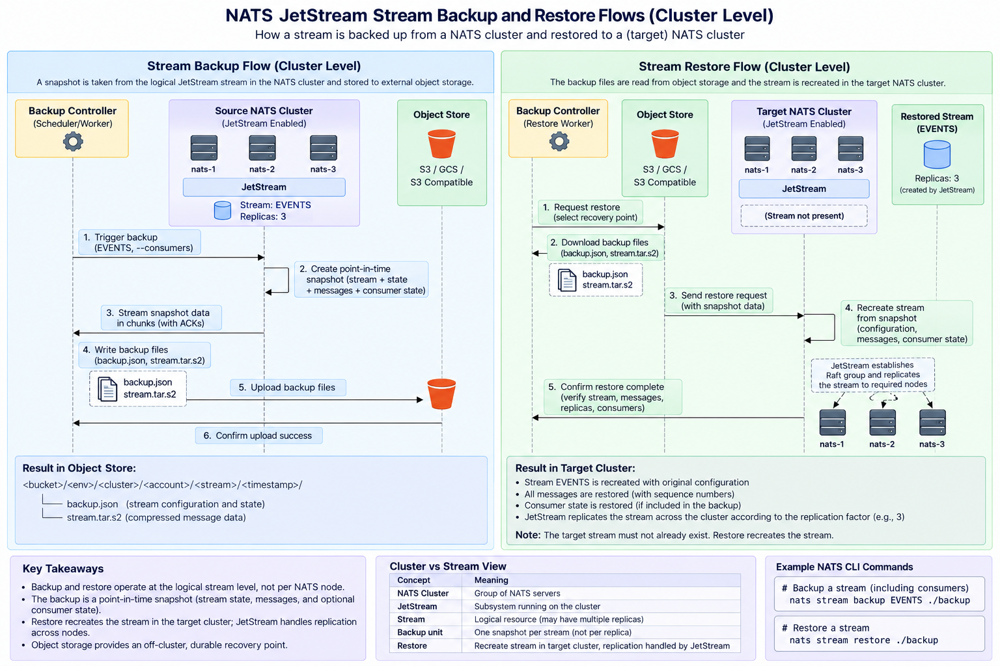

# Stream Backup to Object Store

## 1. Backup and Restore Scope

### 1.1 Scope Model

A JetStream **Stream is a logical, cluster-level managed resource**. It is an abstraction that spans across the NATS cluster based on replications. Each stream replica has exactly the same configuration.

For a replicated stream:

```text
                    NATS Cluster
        +-----------------------------------+
        |                                   |
        |  NATS-1      NATS-2      NATS-3  |
        |     \           |           /     |
        |      +----------+----------+      |
        |                 |                 |
        |             JetStream             |
        |                 |                 |
        |             ORDERS                |
        |            replicas=3             |
        |                                   |
        +-----------------------------------+
```

The stream has one logical identity (`ORDERS`) and its state is replicated across the servers participating in its Raft group.

**Standard:** Backup and restore operate at the **logical Stream level**, not per NATS server or per stream replica. A stream is backed up once regardless of its replication factor.

---

## 2. NATS Backup and Restore Mechanism

### 2.1 Overview and Snapshot Contents

A stream backup is a **point-in-time snapshot** of the logical stream.

With consumer state enabled, the snapshot contains:

* Stream configuration and state
* Stored messages
* Consumer configuration and delivery state

NATS produces two primary artifacts:

| Artifact        | Content                                                                     |
| --------------- | --------------------------------------------------------------------------- |
| `backup.json`   | Stream configuration, state, subjects, limits, retention, sequence metadata |
| `stream.tar.s2` | S2-compressed tar archive containing stream messages                        |

### 2.2 Streaming Mechanics

The NATS server streams the snapshot to the backup client in chunks. The client acknowledges chunks, providing windowed backpressure. NATS documents an 8 MiB default window with 128 KiB chunks.



The backup operation therefore produces **one logical snapshot for the Stream**, not one snapshot per replica.

### 2.3 JetStream Constraints

Important NATS constraints:

* The target stream must not already exist.
* Restore recreates the stream; it does not merge into an existing stream.
* The stream name is taken from `backup.json` and cannot be changed during restore.
* The restored stream is then managed by the target JetStream cluster according to its stream configuration.

### 2.4 Logical vs Physical View

```text
             Logical Stream
                 ORDERS
                    |
          +---------+---------+
          |         |         |
       NATS-1    NATS-2    NATS-3
       Replica   Replica   Replica
          |         |         |
          +---------+---------+
                    |
              ONE SNAPSHOT
                    |
          +---------+---------+
          |                   |
      backup.json       stream.tar.s2
          |                   |
          +---------+---------+
                    |
              Object Store
```

The backup system should therefore reason about **Streams**, not individual replica locations.

---

## 3. Enterprise Solution Design

### 3.1 Target Architecture

Backup should be a **platform-managed capability**, not an implementation responsibility for every application team.

```text
                    Enterprise NATS Platform

        +-------------------------------------------+
        |              NATS Cluster                 |
        |                                           |
        | NATS-1   NATS-2   NATS-3                 |
        |    \       |       /                     |
        |     +------JetStream------+              |
        |            |                              |
        |      Team A / Team B / Team C            |
        |      Streams + Consumers                  |
        +-------------------+-----------------------+
                            |
                            | Snapshot
                            v
                  +---------------------+
                  | Backup Controller   |
                  |                     |
                  | Policy              |
                  | Scheduling          |
                  | Snapshot orchestration |
                  | Verification        |
                  +----------+----------+
                             |
                             v
                  +---------------------+
                  | Backup Worker       |
                  |                     |
                  | nats stream backup  |
                  +----------+----------+
                             |
                             v
                  +---------------------+
                  | Enterprise Object   |
                  | Storage             |
                  |                     |
                  | S3 / GCS / S3 API   |
                  +---------------------+
```

### 3.2 Platform Responsibilities

| Capability                           |                   NATS                    | Platform |  Application Team   |
| ------------------------------------ | :---------------------------------------: | :------: | :-----------------: |
| Backup infrastructure                | Provides stream snapshot/backup mechanism | **Yes**  |         No          |
| Backup scheduling                    |                    No                     | **Yes**  |         No          |
| Object storage                       |                    No                     | **Yes**  |         No          |
| Encryption / IAM                     |   Provides transport/storage primitives   | **Yes**  |         No          |
| Retention / lifecycle                |           Stream retention only           | **Yes**  | Defines requirement |
| Backup monitoring                    |      Provides NATS/JetStream metrics      | **Yes**  |         No          |
| Restore orchestration                |     Provides stream restore mechanism     | **Yes**  |         No          |
| Define business RPO                  |                    No                     |    No    |       **Yes**       |
| Define required retention            |                    No                     |    No    |       **Yes**       |
| Application validation after restore |                    No                     |    No    |       **Yes**       |

Teams should declare backup requirements through platform policy rather than implementing individual CronJobs, S3 clients, and backup scripts.

Example policy:

```text
Stream:       payments.events
Backup:       enabled
RPO:          1 hour
Retention:    90 days
DR Tier:      Regional
```

### 3.3 Backup Flow

```text
1. Backup Controller
       |
       | Select streams based on policy
       v
2. NATS Cluster
       |
       | Create point-in-time snapshot
       v
3. Backup Worker
       |
       | Receive + verify snapshot
       v
4. Object Storage
       |
       | Store recovery point
       v
5. Backup Catalog / Monitoring
```

Recommended object-storage hierarchy:

```text
<nats-backup-bucket>/
  <environment>/
    <cluster>/
      <account>/
        <stream>/
          <timestamp>/
            backup.json
            stream.tar.s2
```

### 3.4 Restore Flow

```text
1. Restore request / DR event
       |
       v
2. Select recovery point
       |
       v
3. Download + integrity verification
       |
       v
4. Recovery NATS Cluster
       |
       v
5. Restore logical Stream
       |
       v
6. JetStream establishes replicated state
       |
       v
7. Verify stream + consumer state
       |
       v
8. Application validation / traffic recovery
```

### 3.5 Enterprise Compatibility

The design is compatible with:

| Requirement            | Design                                          |
| ---------------------- | ----------------------------------------------- |
| Multiple teams         | Stream/account-level backup policies            |
| Multiple NATS clusters | Controller operates against each cluster        |
| JetStream replication  | Backup is independent of replica count          |
| S3                     | Native object-storage target                    |
| S3-compatible storage  | Supported through S3 API                        |
| Kubernetes             | Controller/worker can run as platform workloads |
| Cloud IAM              | Workload Identity / IAM role                    |
| Encryption             | Object-store/KMS encryption                     |
| Retention              | Object-store lifecycle policies                 |
| DR                     | Restore into independent recovery cluster       |
| Automation             | Scheduled controller/worker execution           |

### 3.6 Recommended Enterprise Controls

The platform implementation should provide:

* Encryption in transit and at rest
* Least-privilege object-storage access
* Immutable/versioned backups where required
* Configurable RPO and retention
* Backup success/failure monitoring
* Integrity verification
* Backup catalog/recovery-point tracking
* Periodic restore testing
* Independent recovery storage/failure domain
* Audit trail for backup and restore operations

**Key design principle:** The NATS cluster provides HA; the backup platform provides independent recoverability.

---

## 4. References

[NATS Stream Backup and Restore](https://docs.nats.io/learn/backup-recovery/stream-backup-restore?utm_source=chatgpt.com)

[NATS JetStream Concepts](https://docs.nats.io/concepts/jetstream?utm_source=chatgpt.com)

---