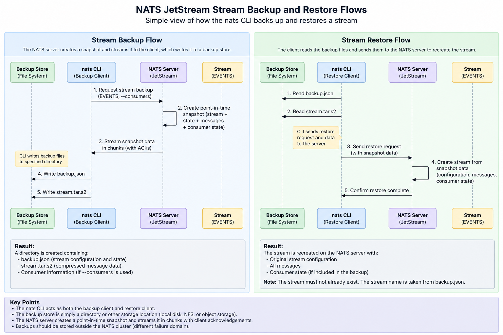

# Scope

This document details the operational lifecycle of NATS JetStream streams, including creation, updates, sequence state management, retention, and purging mechanisms.

## Lifecycle

### Creation

Stream creation initializes the JetStream storage layer, setting the subject bounds, storage backend, replication topology, retention rules, and administrative controls for messages.

#### Stream Configuration Reference

Below are the stream configuration options that can be defined:

| Field | Description | Version | Editable |
| :--- | :--- | :--- | :--- |
| **Name** | Identifies the stream and has to be unique within JetStream account. Names cannot contain whitespace, `.`, `*`, `>`, path separators (forward or backwards slash), and non-printable characters. | 2.2.0 | No |
| **Storage** | The storage type for stream data. | 2.2.0 | No |
| **Subjects** | A list of subjects to bind. Wildcards are supported. Cannot be set for mirror streams. | 2.2.0 | Yes |
| **Replicas** | How many replicas to keep for each message in a clustered JetStream, maximum 5. | 2.2.0 | Yes |
| **MaxAge** | Maximum age of any message in the Stream, expressed in nanoseconds. | 2.2.0 | Yes |
| **MaxBytes** | Maximum number of bytes stored in the stream. Adheres to Discard Policy, removing oldest or refusing new messages if the Stream exceeds this size. | 2.2.0 | Yes |
| **MaxMsgs** | Maximum number of messages stored in the stream. Adheres to Discard Policy, removing oldest or refusing new messages if the Stream exceeds this number of messages. | 2.2.0 | Yes |
| **MaxMsgSize** | The largest message that will be accepted by the Stream. The size of a message is a sum of payload and headers. | 2.2.0 | Yes |
| **MaxConsumers** | Maximum number of Consumers that can be defined for a given Stream, `-1` for unlimited. | 2.2.0 | No |
| **NoAck** | Default `false`. Disables acknowledging messages that are received by the Stream. This is mandatory when archiving messages which have a reply subject set. E.g. requests in an Request/Reply communication. By default JetStream will acknowledge each message with an empty reply on the reply subject. | 2.2.0 | Yes |
| **Retention** | Declares the retention policy for the stream. | 2.2.0 | No |
| **Discard** | The behavior of discarding messages when any streams' limits have been reached. | 2.2.0 | Yes |
| **DuplicateWindow** | The window within which to track duplicate messages, expressed in nanoseconds. | 2.2.0 | Yes |
| **Placement** | Used to declare where the stream should be placed via tags and/or an explicit cluster name. | 2.2.0 | Yes |
| **Mirror** | If set, indicates this stream is a mirror of another stream. | 2.2.0 | Yes (since 2.12.0) |
| **Sources** | If defined, declares one or more streams this stream will source messages from. | 2.2.0 | Yes |
| **MaxMsgsPerSubject** | Limits maximum number of messages in the stream to retain per subject. | 2.3.0 | Yes |
| **Description** | A verbose description of the stream. | 2.3.3 | Yes |
| **Sealed** | Sealed streams do not allow messages to be deleted via limits or API, sealed streams can not be unsealed via configuration update. Can only be set on already created streams via the Update API. | 2.6.2 | Yes (once) |
| **DenyDelete** | Restricts the ability to delete messages from a stream via the API. | 2.6.2 | No |
| **DenyPurge** | Restricts the ability to purge messages from a stream via the API. | 2.6.2 | No |
| **AllowRollup** | Allows the use of the `Nats-Rollup` header to replace all contents of a stream, or subject in a stream, with a single new message. | 2.6.2 | Yes |
| **RePublish** | If set, messages stored to the stream will be immediately republished to the configured subject. | 2.8.3 | Yes |
| **AllowDirect** | If true, and the stream has more than one replica, each replica will respond to direct get requests for individual messages, not only the leader. | 2.9.0 | Yes |
| **MirrorDirect** | If true, and the stream is a mirror, the mirror will participate in a serving direct get requests for individual messages from origin stream. | 2.9.0 | Yes |
| **DiscardNewPerSubject** | If true, applies discard new semantics on a per subject basis. Requires `DiscardPolicy` to be `DiscardNew` and the `MaxMsgsPerSubject` to be set. | 2.9.0 | Yes |
| **Metadata** | A set of application-defined key-value pairs for associating metadata on the stream. | 2.10.0 | Yes |
| **Compression** | If file-based and a compression algorithm is specified, the stream data will be compressed on disk. Valid options are nothing (empty string) or `s2` for Snappy compression. | 2.10.0 | Yes |
| **FirstSeq** | If specified, a new stream will be created with its initial sequence set to this value. | 2.10.0 | No |
| **SubjectTransform** | Applies a subject transform (to matching messages) before storing the message. | 2.10.0 | Yes |
| **ConsumerLimits** | Sets default limits for consumers created for a stream. Those can be overridden per consumer. | 2.10.0 | Yes |
| **AllowMsgTTL** | If set, allows header initiated per-message TTLs, instead of relying solely on `MaxAge`. | 2.11.0 | No (can only enable) |
| **SubjectDeleteMarkerTTL** | If set, a subject delete marker will be placed after the last message of a subject ages out. This defines the TTL of the delete marker that is left behind. | 2.11.0 | Yes |
| **AllowAtomicPublish** | If set, allows atomically writing a batch of N messages into the stream. | 2.12.0 | Yes |
| **AllowBatchPublish** | If set, allows writing a batch of N messages into the stream. | 2.14.0 | Yes |
| **AllowMsgCounter** | If set, the stream will function as a counter stream, hosting distributed counter CRDTs. | 2.12.0 | No |
| **AllowMsgSchedules** | If set, allows message scheduling in the stream. | 2.12.0 | No (can only enable) |

A stream can be created using the NATS CLI by supplying a JSON configuration file:
```bash
nats stream add EVENTS --config=stream.json
```

`stream.json` defines the initial stream configuration:
```json
{
  "name": "EVENTS",
  "description": "Stream for storing orders and payments related events",
  "subjects": [
    "order.*",
    "payment.*"
  ],
  "retention": "limits",
  "max_consumers": -1,
  "max_msgs_per_subject": -1,
  "max_msgs": -1,
  "max_bytes": -1,
  "max_age": 0,
  "max_msg_size": -1,
  "storage": "file",
  "discard": "old",
  "num_replicas": 3,
  "duplicate_window": 120000000000,
  "sealed": false,
  "deny_delete": false,
  "deny_purge": false,
  "allow_rollup_hdrs": false,
  "allow_direct": true,
  "mirror_direct": false,
  "discard_new_per_subject": false,
  "allow_msg_ttl": false,
  "allow_atomic_publish": false,
  "allow_batch_publish": false,
  "allow_msg_counter": false,
  "allow_msg_schedules": false,
  "subject_delete_marker_ttl": 0,
  "first_seq": 1,
  "compression": "none",
  "republish": {
    "src": "order.*",
    "dest": "republished.order.*"
  },
  "subject_transform": {
    "src": "order.*",
    "dest": "transformed.order.*"
  },
  "placement": {
    "cluster": "cl1",
    "tags": ["zone-a"]
  },
  "consumer_limits": {
    "inactive_threshold": 86400000000000,
    "max_ack_pending": 1000
  },
  "metadata": {
    "env": "production",
    "team": "orders"
  }
}
```

### Update

Existing stream configurations can be modified dynamically using the NATS CLI without re-creating the stream or losing stored message history.

```bash
nats stream edit EVENTS --config=stream-update.json
```

Fields which cannot be updated (immutable):
- Name (Stream name cannot be modified once created)
- Storage

### Sequence Handling

Movement of First Seq (`f`) and Last Seq (`l`) controls sequence bounds in the stream write-ahead log.

Initial State (10 stored messages):
Command:
```bash
nats stream info EVENTS
```
Sequence Pointers:
First Sequence: 1
Last Sequence: 10

Number Line View:
```bash
Write-Ahead-Log-Index: 1 2 3 4 5 6 7 8 9 10
                       f                 l
```

1. Purging all messages

Command:
```bash
nats stream purge EVENTS -f
```
Sequence Pointers:
First Sequence: 11
Last Sequence: 10 (Stream is empty; next sequence will be 11)

Number Line View:
```bash
Write-Ahead-Log-Index: 1 2 3 4 5 6 7 8 9 10 [11]
                                             f,l
```

2. Purging all messages below a message sequence

Command:
```bash
nats stream purge EVENTS --seq=4 -f
```
Sequence Pointers:
First Sequence: 4
Last Sequence: 10

Number Line View:
```bash
Write-Ahead-Log-Index: 1 2 3 4 5 6 7 8 9 10
                             f           l
```

3. Purging all messages by retaining last N messages

Command:
```bash
nats stream purge EVENTS --keep=3 -f
```
Sequence Pointers:
First Sequence: 8
Last Sequence: 10

Number Line View:
```bash
Write-Ahead-Log-Index: 1 2 3 4 5 6 7 8 9 10
                                   f     l
```

### Retention Handling

Retention dictates when messages are automatically deleted from the stream (`retention` in stream configuration):

1. Limits Retention (`retention: "limits"`)
   - Default policy. Messages are retained until explicit stream limits (`max_msgs`, `max_bytes`, `max_age`, `max_msgs_per_subject`) are breached.
   - Consumers can join at any time and replay stored messages.

2. Interest Retention (`retention: "interest"`)
   - Messages are automatically removed once all active consumers registered for the stream's subjects have acknowledged (`ACK`) them.
   - If no consumers exist when a message is published, the message is removed immediately.

3. Work Queue Retention (`retention: "workqueue"`)
   - Messages are automatically removed as soon as ANY single consumer acknowledges (`ACK`) the message.
   - Designed for worker-queue pattern processing where each event is processed exactly once by a single worker.

Supporting Commands:

1. Limits Retention Setup on EVENTS Stream

```bash
# Update EVENTS stream configuration with explicit storage and capacity limits (max 10 messages)
nats stream edit EVENTS \
  --max-msgs=5 \
  --max-bytes=10MB

# Publish 10 messages to order.placed (exceeding the max-msgs=10 limit)
nats pub --jetstream order.placed --count 10 "Message {{Count}} @ {{Time}}"
```

2. Interest Retention Setup with 2 Consumers on EVENTS Stream

```bash
# Re-create EVENTS stream with interest retention policy
# Note: Changing retention policy requires re-creating the stream (--force)
nats stream add EVENTS \
  --subjects="order.*","payment.*" \
  --retention=interest \
  --storage=file \
  --force

# Create Consumer 1 (C1) on EVENTS
nats consumer add EVENTS C1 \
  --filter="order.*" \
  --ack=explicit \
  --pull

# Create Consumer 2 (C2) on EVENTS
nats consumer add EVENTS C2 \
  --filter="order.*" \
  --ack=explicit \
  --pull

# Publish a test message
nats pub order.created "Order Event 1"

# Consume and ACK with Consumer 1 (Message retained in EVENTS; waiting for C2)
nats consumer next EVENTS C1

# Consume and ACK with Consumer 2 (Message purged from EVENTS once both C1 and C2 ACK)
nats consumer next EVENTS C2
```

3. Work Queue Retention Setup on EVENTS Stream

```bash
# Re-create EVENTS stream with workqueue retention policy
nats stream add EVENTS \
  --subjects="order.*","payment.*" \
  --retention=workqueue \
  --storage=file \
  --force

# Create a pull worker consumer on EVENTS
nats consumer add EVENTS WORKER \
  --filter="order.*" \
  --ack=explicit \
  --pull

# Publish a job task
nats pub order.created "Process Payment Task"

# Consume and ACK with WORKER (Message purged from EVENTS immediately upon 1st ACK)
nats consumer next EVENTS WORKER
```

### Cleanup Policies

Cleanup policies govern how JetStream manages storage bounds and removes limit-exceeded messages:

Critical Pitfall:
- Unbounded Disk Space Exhaustion: If retention limits (`max_msgs`, `max_bytes`, `max_age`) are not configured properly on a file-backed stream, continuous message publishing will exhaust available filesystem space, causing the NATS server node to crash or fail.

1. Discard Old (`discard: "old"`)
   - Default limit-enforcement policy (`max_msgs` or `max_bytes`).
   - Oldest messages are discarded (`FirstSeq` advances forward) to make space for incoming messages.

   Number Line View (Limit = 10, Message 11 arrives):
   ```bash
   Write-Ahead-Log-Index: [1] 2 3 4 5 6 7 8 9 10 11
                              f                  l
   ```

2. Discard New (`discard: "new"`)
   - When stream limits (`max_msgs` or `max_bytes`) are reached, new incoming published messages are rejected with an error (`nats: JetStream stream limit reached`).
   - Preserves existing stored dataset without dropping older events.

Supporting Commands:

1. Discard Old Setup and Demonstration

```bash
# Configure EVENTS stream with discard=old policy and max-msgs=5
nats stream edit EVENTS \
  --discard=old \
  --max-msgs=5

# Publish 7 messages (exceeding the 5-message limit)
nats pub --jetstream order.placed --count 7 "Message {{Count}} @ {{Time}}"

# View stream state to confirm oldest messages 1 and 2 were dropped (FirstSeq: 3, LastSeq: 7)
nats stream info EVENTS
```

2. Discard New Setup and Demonstration

```bash
# Purge stream and re-configure EVENTS stream with discard=new policy and max-msgs=5
nats stream purge EVENTS -f
nats stream edit EVENTS \
  --discard=new \
  --max-msgs=5

# Publish 5 messages to fill stream capacity
nats pub --jetstream order.placed --count 5 "Message {{Count}} @ {{Time}}"

# Attempt to publish a 6th message (rejected by server with stream limit error)
nats pub --jetstream order.placed "Overflow Message 6"

# View stream state to confirm original 5 messages are retained (FirstSeq: 1, LastSeq: 5)
nats stream info EVENTS
```

### Backup and Restore

NATS JetStream supports snapshotting stream state and stored messages for backup and disaster recovery operations.

Snapshot Artifacts:
- `backup.json`: Stream state, configuration metadata, consumer states, and sequence offset boundaries.
- `stream.tar.s2`: s2-compressed log file segments containing stored stream messages.



Backup CLI Configuration Options:
- `--[no-]consumers`: Toggles including consumer definitions, durability states, and ACK sequence positions in the backup (default: `--consumers`).
- `--chunk-size=CHUNK-SIZE`: Sets the byte size of each data chunk sent by the server during backup streaming (e.g., `1024KB`). Controls transfer packet sizing.
- `--window-size=WINDOW-SIZE`: Sets the sliding flow-control window size (outstanding unacknowledged bytes) during snapshot transfer. Tuning this option mitigates network timeouts and rate-mismatch issues over slow disks or distant links.

Key Operational Pitfalls:
- Memory-backed streams (`storage: "memory"`) cannot be snapshotted.
- The stream name cannot be modified during a restore operation (must restore under original stream name).
- Flow control can time out during backup/restore over slow disks or high-latency network links (tune `--window-size` and `--chunk-size` to prevent timeouts).

```bash
# Check current state
nats stream state EVENTS

# Backup to file with explicit consumer inclusion, chunk-size, and window-size tuning
nats stream backup EVENTS "./backups/events/$(date +%Y-%m-%d)" \
  --consumers \
  --chunk-size=1024KB \
  --window-size=8MB

# Delete the stream
nats stream rm EVENTS

# Restore the stream
nats stream restore ./backups/events/$(date +%Y-%m-%d)
```

#### Stream Backup to Object Store (S3)
- Covered in separate reference document - [Stream Backup to Object Store](../stream_backup_object_store.md)

### Creteria for creating seperate streams

A Stream is the unit at which NATS applies storage, retention, ordering, replication, placement, and other stream-level policies. Therefore, subjects that need the same stream-level behavior can generally share a stream; subjects that require materially different stream-level behavior should be separated into different streams.

**NATS Documentation Says:**
> Relatively speaking the Stream is the most resource consuming component so being able to combine related data in this manner is important to consider.
Reference: https://github.com/nats-io/nats.docs/blob/master/nats-concepts/jetstream/streams.md


| Priority | Criterion                            | Same Stream                                                                              | Separate Streams                                                                                  |
| -------: | ------------------------------------ | ---------------------------------------------------------------------------------------- | ------------------------------------------------------------------------------------------------- |
|    **1** | **Retention Policy**                 | Subjects have the same retention requirements (`MaxAge`, `MaxBytes`, retention behavior) | Subjects require materially different retention periods or retention semantics                    |
|    **2** | **Replication / Durability**         | Same availability, durability and replication requirements                               | Different replication factors or different durability/HA requirements                             |
|    **3** | **Placement / Cluster Boundary**     | Data can reside in the same NATS cluster and placement domain                            | Data must reside in different clusters, regions, accounts or placement boundaries                 |
|    **4** | **Ordering Requirement**             | Subjects belong to the same logical ordering domain and cross-subject ordering is useful | Subjects have independent ordering domains or must not share ordering                             |
|    **5** | **Backup / DR Policy**               | Same RPO, retention and DR tier                                                          | Different backup frequency, RPO, recovery requirements or DR tier                                 |
|    **6** | **Security / Tenancy Boundary**      | Same security, access-control and ownership boundary                                     | Different teams, tenants, trust boundaries or access-control requirements                         |
|    **7** | **Lifecycle / Ownership**            | Same application/domain ownership and lifecycle                                          | Independently owned, deployed, changed or retired                                                 |
|    **8** | **Workload / Scale Characteristics** | Similar throughput, message size, traffic pattern and resource profile                   | One workload has substantially different scale, throughput, message size or resource requirements |
|    **9** | **Consumption Model**                | Consumers can independently filter/process the subjects from the same stream             | Subjects require fundamentally different stream-level behavior that consumers cannot address      |
|   **10** | **Operational Management**           | Can be monitored, governed, backed up and recovered together                             | Requires independent monitoring, alerting, backup, recovery or operational controls               |
