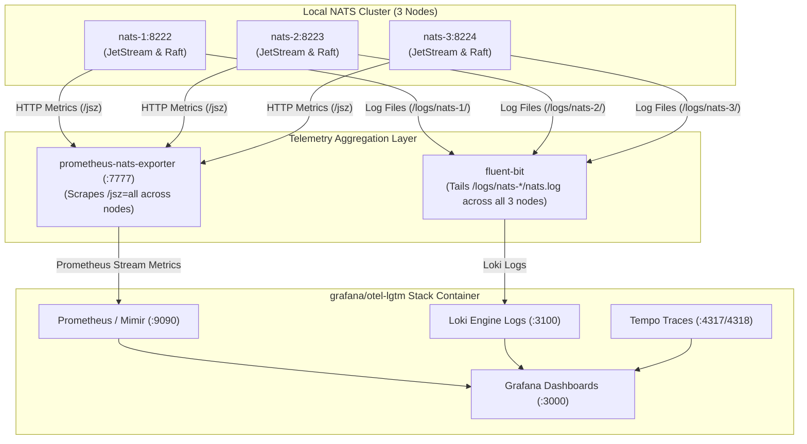

# Scope

This document details the telemetry architecture, monitoring primitives, health indicators, resource consumption metrics, overload conditions, replication status, and hands-on observability workflows for NATS JetStream streams.

## 1. Observability Architecture & Primitives

Stream Observability in NATS JetStream focuses specifically on monitoring the state, performance, health, data lifecycle, and message flows of JetStream streams and consumers. While NATS server handles core message routing and storage, stream observability requires tracking stream-level metrics, stream advisory events, storage logs, and application-level trace propagation across message boundaries.

### 1.1 What NATS Provides for Stream Observability (MELT Primitives)

#### 1.1.1 Stream Metrics (HTTP JetStream Monitoring)
NATS provides stream-level telemetry primarily through the JetStream monitoring endpoint (`/jsz`) on the HTTP monitoring port (default `8222`):
- **Stream State & Capacity**: `/jsz?streams=true` exposes message count, total bytes, first/last sequence numbers, active consumer count, and storage utilization (file vs. memory) per stream.
- **Raft Consensus & Replication**: For clustered streams ($R > 1$), `/jsz` reports stream leader node, follower sync state, Raft group quorum status, and catch-up sequence lag.
- **Account & API Limits**: `/jsz?account=$G` tracks stream API request rates, storage limit enforcement, and discard policy triggers (`discard_old` vs. `discard_new`).

These endpoints are scraped by `prometheus-nats-exporter` to produce stream-focused Prometheus metrics (e.g., `gnatsd_jsz_stream_messages`, `gnatsd_jsz_stream_bytes`, `gnatsd_jsz_stream_consumers`).

#### 1.1.2 Stream Advisory Events (System Subject Stream)
Rather than polling monitoring endpoints, JetStream automatically emits real-time, structured JSON advisories for stream lifecycle and operational events on reserved `$SYS.EVENT.ADVISORY.STREAM.>` subjects:
- **Lifecycle Advisories**: `$SYS.EVENT.ADVISORY.STREAM.CREATED.<STREAM>`, `.DELETED.<STREAM>`, `.UPDATED.<STREAM>`
- **Operational & Storage Advisories**: `$SYS.EVENT.ADVISORY.STREAM.SLOW_CONSUMER.<STREAM>`, `.QUORUM_LOST.<STREAM>`
- **Consumer Advisories**: `$SYS.EVENT.ADVISORY.CONSUMER.ACK_EXPIRED.<STREAM>.<CONSUMER>`, `.PAUSED.<STREAM>.<CONSUMER>`

Subscribing to these system subjects enables event-driven stream monitoring and real-time alerting for stream creation, quota breaches, or storage degradation.

#### 1.1.3 Engine Logs for Streams (Server Storage & Raft Logs)
The NATS server writes structured operational log streams (`log_file`, `logtime`) containing stream-specific engine events:
- Stream creation and initialization parameters.
- Raft leader election transitions and quorum recovery for clustered streams.
- JetStream storage allocation warnings, message deduplication window purges, and disk write errors.

Log forwarders (e.g. Fluent Bit) tail server log files and push stream engine log entries to backends like Loki.

#### 1.1.4 Tracing (Application-Level Context Propagation)
*Important Distinction*: NATS server and JetStream streams **do NOT natively emit OpenTelemetry traces** internally for stream operations. Instead, distributed tracing across streams is achieved through **application-level context propagation**:
- **Publisher**: When publishing a message to a stream subject, the producer application injects W3C Trace Context headers (`traceparent`, `tracestate`) into `nats.Header`.
- **JetStream Storage**: NATS JetStream transparently persists `nats.Header` alongside message payloads without altering trace context.
- **Consumer**: When consuming or fetching messages from the stream, the subscriber application extracts `traceparent` from `nats.Header` to continue the OpenTelemetry trace span across the stream boundary in backends like Tempo or Jaeger.

---

### 1.2 Reference Local Stack Setup (Demo-Scoped Infrastructure)

In our reference environment (`deploy/local-nats-cluster`), stream telemetry is aggregated as follows:



- **Stream Metrics**: `prometheus-nats-exporter` scrapes HTTP monitoring endpoints (`/jsz=all`) across all 3 nodes (`nats-1:8222`, `nats-2:8223`, `nats-3:8224`) and feeds Prometheus inside `otel-lgtm`.
- **Stream Engine Logs**: `fluent-bit` tails server log files directly from all 3 nodes (`/logs/nats-*/nats.log`) and pushes log streams into Loki inside `otel-lgtm`.
- **Grafana Stream Dashboard**: Grafana automatically loads [`deploy/local-nats-cluster/stream-dashboard.json`](file:///Users/mulukahemanthkumar/Documents/dev/learning/nats/deploy/local-nats-cluster/stream-dashboard.json) on startup via provisioning rules in [`grafana-dashboards.yml`](file:///Users/mulukahemanthkumar/Documents/dev/learning/nats/deploy/local-nats-cluster/grafana-dashboards.yml).

---

## 2. Stream Metrics & Monitoring Standards

### 2.1 Health

Health monitoring confirms process vitality, server responsiveness, HTTP API health, and consensus engine stability across all cluster nodes.

| Metric / Advisory / Parameter | Description | Prometheus Exporter / Event | Link to Check (Browser URL) | Justification & Operational Value |
| :--- | :--- | :--- | :--- | :--- |
| **Process Liveness** | Binary health indicator for server vitality | `gnatsd_healthz_status or gnatsd_up` | [http://localhost:8222/healthz?jsz=true](http://localhost:8222/healthz?jsz=true) | Validates that both NATS core and JetStream engine are active for container probes and load balancers. |
| **Server Uptime** | Runtime of server process in seconds | `gnatsd_varz_uptime` | [http://localhost:8222/varz](http://localhost:8222/varz) | Tracks process running duration; sudden drops alert on silent container restarts or crashes. |
| **Meta Leader Status** | Active leader node for JetStream Meta cluster | `gnatsd_jsz_meta_cluster_leader` | [http://localhost:8222/jsz](http://localhost:8222/jsz) | JetStream stream/consumer creation requires an active Meta Leader; if 0 across all nodes, admin APIs fail. |
| **Meta Peer Health** | Connectivity status of Meta Raft cluster peers | `gnatsd_jsz_meta_cluster_peer_healthy` | [http://localhost:8222/jsz](http://localhost:8222/jsz) | Monitors Raft peer health within the control plane to detect cluster network partitions early. |
| **Management API Errors** | JetStream API request and error counters | `gnatsd_jsz_api_total`, `gnatsd_jsz_api_errors` | [http://localhost:8222/jsz](http://localhost:8222/jsz) | Isolates client management/permission errors from regular message publish/subscribe workload traffic. |

---

### 2.2 Resource Consumption

Resource consumption telemetry monitors memory, CPU, disk storage, file descriptors, and network bandwidth utilization across NATS Core and JetStream streams.

| Metric / Advisory / Parameter | Description | Prometheus Exporter / Event | Link to Check (Browser URL) | Justification & Operational Value |
| :--- | :--- | :--- | :--- | :--- |
| **CPU Usage** | CPU utilization percentage of `nats-server` | `gnatsd_varz_cpu` | [http://localhost:8222/varz](http://localhost:8222/varz) | Identifies processor saturation and compute bottlenecks during high-throughput workloads. |
| **Process Memory (RSS)** | Total Resident Set Size RAM consumed by server | `gnatsd_varz_mem` | [http://localhost:8222/varz](http://localhost:8222/varz) | Measures process memory usage to prevent host OS Out-Of-Memory (OOM) killer terminations. |
| **JetStream RAM Storage** | Bytes consumed vs reserved for memory streams | `gnatsd_jsz_memory_used_bytes` | [http://localhost:8222/jsz?accounts=true](http://localhost:8222/jsz?accounts=true) | Tracks RAM usage of `Storage: Memory` streams against account quotas to prevent memory limit rejection. |
| **JetStream Disk Storage** | Bytes consumed vs reserved for disk streams | `gnatsd_jsz_storage_used_bytes` | [http://localhost:8222/jsz?accounts=true](http://localhost:8222/jsz?accounts=true) | Monitors disk usage for `Storage: File` streams to avoid disk space exhaustion and write blocks. |
| **Per-Stream Footprint** | Storage bytes occupied per individual stream | `gnatsd_jsz_stream_bytes` | [http://localhost:8222/jsz?streams=true](http://localhost:8222/jsz?streams=true) | Measures storage per stream to validate and tune retention policies (`MaxBytes`, `MaxAge`). |
| **Per-Stream Message Count** | Total message count stored in stream | `gnatsd_jsz_stream_messages` | [http://localhost:8222/jsz?streams=true](http://localhost:8222/jsz?streams=true) | Tracks stored volume per stream for retention auditing and growth monitoring. |
| **Per-Stream Consumer Count** | Active consumers bound to stream | `gnatsd_jsz_stream_consumers` | [http://localhost:8222/jsz?streams=true](http://localhost:8222/jsz?streams=true) | Monitors consumer attached density per stream to ensure expected worker attachment. |
| **Open File Descriptors** | Open sockets and file handles held by process | `gnatsd_varz_open_files` | [http://localhost:8222/varz](http://localhost:8222/varz) | Monitors open file handles to prevent breaching operating system limits (`ulimit -n`). |
| **Network Throughput** | Raw ingress and egress byte and message rates | `gnatsd_varz_in_bytes`, `gnatsd_varz_out_bytes` | [http://localhost:8222/varz](http://localhost:8222/varz) | Captures network I/O traffic rates to identify network bandwidth saturation. |

---

### 2.3 Overload Conditions

Overload observability identifies message backpressure, client buffer overflows, slow consumers, message drop policies, expired acknowledgements, and message redeliveries.

| Metric / Advisory / Parameter | Description | Prometheus Exporter / Event | Link to Check (Browser URL) | Justification & Operational Value |
| :--- | :--- | :--- | :--- | :--- |
| **Slow Core Consumers** | Connections with overflowing client write buffers | `gnatsd_varz_slow_consumers` | [http://localhost:8222/varz](http://localhost:8222/varz) | Counts slow Core NATS connections facing server disconnects due to buffer overflows. |
| **Consumer Pending Messages** | Unread messages waiting in stream for consumer | `gnatsd_jsz_consumer_num_pending` | [http://localhost:8222/jsz?consumers=true](http://localhost:8222/jsz?consumers=true) | Quantifies unprocessed backlog; primary indicator that downstream worker scaling is required. |
| **In-Flight Pending ACKs** | Delivered messages awaiting client ACK | `gnatsd_jsz_consumer_num_ack_pending` | [http://localhost:8222/jsz?consumers=true](http://localhost:8222/jsz?consumers=true) | Measures in-flight processing load; high values indicate worker slowness or `MaxAckPending` saturation. |
| **Message Redeliveries** | Redelivered messages count due to ACK timeouts | `gnatsd_jsz_consumer_num_redelivered` | [http://localhost:8222/jsz?consumers=true](http://localhost:8222/jsz?consumers=true) | Spikes signal consumer worker crashes, unhandled exceptions, or poison messages. |
| **ACK Expired Advisory** | Event fired when consumer ACK timer expires | `$SYS.EVENT.ADVISORY.CONSUMER.ACK_EXPIRED.>` | [http://localhost:8222/jsz?consumers=true](http://localhost:8222/jsz?consumers=true) | Emits real-time event when an ACK timer expires for immediate alert triggering. |
| **Slow Consumer Advisory** | Event fired when subscriber falls behind stream | `$SYS.EVENT.ADVISORY.STREAM.SLOW_CONSUMER.>` | [http://localhost:8222/jsz?consumers=true](http://localhost:8222/jsz?consumers=true) | Real-time advisory alerting that a subscriber cannot match stream message ingestion rate. |
| **Storage Limit Reached** | Count of quota limit breach error events | `gnatsd_jsz_account_limits_errors` | [http://localhost:8222/jsz?accounts=true](http://localhost:8222/jsz?accounts=true) | Tracks storage/message limit triggers where messages are rejected or discarded by policy. |

---

### 2.4 Replication Status

Replication status telemetry tracks Raft consensus stability, stream leader placement, peer catch-up sequence lag, and cluster quorum health across multi-replica streams ($R > 1$).

| Metric / Advisory / Parameter | Description | Prometheus Exporter / Event | Link to Check (Browser URL) | Justification & Operational Value |
| :--- | :--- | :--- | :--- | :--- |
| **Stream Raft Leader** | Active Raft leader node for a specific stream | `gnatsd_jsz_stream_cluster_leader` | [http://localhost:8222/jsz?streams=true](http://localhost:8222/jsz?streams=true) | Identifies current Raft leader node handling write requests for a clustered stream. |
| **Replica Sequence Lag** | Message sequence delta between follower and leader | `gnatsd_jsz_stream_cluster_peer_lag` | [http://localhost:8222/jsz?streams=true](http://localhost:8222/jsz?streams=true) | Measures sequence gap on followers; high lag warns of disk I/O bottlenecks or network partition. |
| **Replica Active Delta** | Nanoseconds since last Raft heartbeat from peer | `gnatsd_jsz_stream_cluster_peer_active` | [http://localhost:8222/jsz?streams=true](http://localhost:8222/jsz?streams=true) | Tracks peer responsiveness; high deltas precede follower disconnection and election triggers. |
| **Quorum Lost Advisory** | Event fired when stream Raft quorum is lost | `$SYS.EVENT.ADVISORY.STREAM.QUORUM_LOST.>` | [http://localhost:8222/jsz?streams=true](http://localhost:8222/jsz?streams=true) | Real-time event when Raft quorum ($R/2 + 1$) drops, halting writes to ensure data consistency. |
| **Leader Re-elections & Server Logs** | Raft term changes, leader elections, and server events | Server engine log stream (Fluent Bit $\rightarrow$ Loki) | [http://localhost:3000](http://localhost:3000) | Log stream monitoring in Grafana Loki panel (`JetStream Raft & Server Engine Logs`) to inspect flapping nodes or storage warnings. |

---

### 2.5 Capacity Thresholds

### 2.6 Reactive Approach on New Subject, Stream, and Infrastructure

---

## 3. Hands-On CLI & Observability Demonstrations

### 3.1 Inspecting Stream Monitoring Endpoints (`/jsz`)

1. Setting up:
```bash
# Ensure local NATS cluster is running and EVENTS stream is created
nats stream add EVENTS \
  --subjects="order.*","payment.*" \
  --storage=file \
  --replicas=3 \
  --force
```

2. Simulating the Behaviour:
```bash
# Publish test messages to populate stream telemetry
nats pub order.placed --count=5 "Order Event Payload {{Count}}"
```

3. Checking the behaviour and working:
```bash
# Query HTTP monitoring endpoints directly for stream metrics
curl -s "http://localhost:8222/jsz?streams=true" | jq .
curl -s "http://localhost:8222/jsz?consumers=true" | jq .
```

### 3.2 Subscribing to Stream Advisory Events (`$SYS.EVENT.ADVISORY.>`)

1. Setting up:
Open a terminal listener on system advisory subjects:
```bash
nats sub "\$SYS.EVENT.ADVISORY.STREAM.>"
```

2. Simulating the Behaviour:
In a separate terminal, trigger stream creation and deletion events:
```bash
nats stream add TEST_ADVISORY --subjects="advisory.test" --storage=memory --force
nats stream rm TEST_ADVISORY -f
```

3. Checking the behaviour and working:
Verify that structured JSON advisories (`CREATED`, `DELETED`) are emitted and received in real-time.

### 3.3 Querying Stream Telemetry via Prometheus Exporter

1. Setting up:
Ensure `prometheus-nats-exporter` is running on port 7777.

2. Simulating the Behaviour:
```bash
# Generate workload traffic on EVENTS stream
nats pub order.created "Telemetry Test Payload"
```

3. Checking the behaviour and working:
```bash
# Query scraped Prometheus metrics for stream byte footprint and message counts
curl -s "http://localhost:7777/metrics" | grep gnatsd_jsz_stream
```

### 3.4 Benchmark Workload Generation & Dashboard Verification (`nats bench`)

Use `nats bench` and targeted NATS CLI operations to generate workload traffic across all tiles in the Grafana Stream Observability dashboard ([http://localhost:3000](http://localhost:3000)).

1. Setting up:
```bash
# Create a 3-replica clustered stream using standard order.* and payment.* subjects
nats stream add EVENTS \
  --subjects="order.*","payment.*" \
  --storage=file \
  --replicas=3 \
  --force

# Create a pull consumer for pending backlog and ACK tracking
nats consumer add EVENTS WORKER \
  --pull \
  --ack explicit \
  --ack-wait=5s \
  --max-deliver=3 \
  --max-pending=1000 \
  --force
```

2. Simulating the Behaviour:
```bash
# 1. High-throughput benchmark workload (Populates CPU, Memory, Network I/O, Stream Bytes, Stream Messages)
nats bench pub order.placed --clients=2 --msgs=10000 --size=256

# 2. Populate Pending Backlog & Pending ACKs in Grafana
nats pub order.placed --count=500 "Backlog Payload {{Count}}"

# Fetch unacknowledged messages to generate In-Flight Pending ACKs and trigger redelivery rate
nats consumer next EVENTS WORKER --count=50 --no-ack

# 3. Simulate Storage Quota Limit Breaches (Populates Account Limit Error Events)
nats stream add QUOTA_STREAM --subjects="payment.quota" --max-bytes=10000 --discard=new --storage=file --force
nats pub payment.quota --count=100 --size=1024 "Quota Exhaustion Payload"

# 4. Generate Management API Traffic & Engine Logs
nats stream ls
nats stream info EVENTS
```

3. Checking the behaviour and working:
```bash
# Verify Grafana Dashboard view at http://localhost:3000 (User: admin / Password: admin)
# Observe data points across all tiles:
# - Row 1: Exporter & Healthz Liveness, Uptime, Meta Leader, Meta Peer Healthy, API Traffic & Errors
# - Row 2: CPU %, Memory RSS, Stream Bytes, Stream Message Count, Stream Consumer Count, Open Files, Ingress/Egress Rate
# - Row 3: Consumer Pending Messages, In-Flight Pending ACKs, Message Redeliveries, Storage Limit Error Events
# - Row 4: Stream Raft Leaders, Replica Lag, Replica Heartbeat Delta, JetStream Raft & Engine Logs (Loki)
```