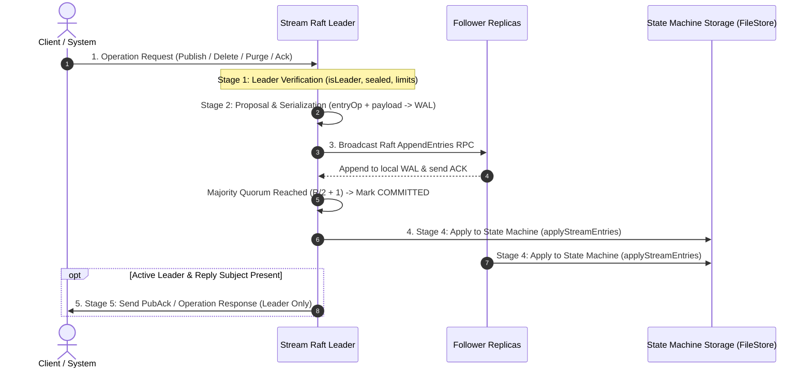

# Cluster Operations & Unified Execution Pipeline

Every cluster operation in NATS JetStream -- whether publishing a message, deleting a message, purging a stream, or updating consumer state -- executes through a unified multi-stage Raft consensus pipeline. This document details the 2-tier opcode architecture, the 5-stage operation lifecycle, operation-specific deep dives, atomic batch publishing, and Go runtime loop internals.

---

## 1. 2-Tier Opcode Architecture

NATS operates with two distinct layers of opcodes to cleanly separate Raft cluster protocol mechanics from JetStream stream/consumer state machine operations. Low-level Raft entry types control consensus cluster membership and log synchronization, while JetStream application opcodes (`entryOp`) are serialized inside `EntryNormal.Data` payloads to drive stream and consumer state transitions.

### 1.1 Layer 1: Low-Level Raft Entry Types (`EntryType` in `raft.go`)

| Entry Type | Protocol Role | Description |
| :--- | :--- | :--- |
| `EntryNormal` | Application Payload Carrier | Carries JetStream application data (contains serialized `entryOp` in `EntryNormal.Data`) |
| `EntrySnapshot` | Log Compaction | Signals a state snapshot point, compacting log entries up to `commitIndex` |
| `EntryPeerState` | Metadata Update | Transmits Raft peer metadata, configuration updates, and term synchronization |
| `EntryCatchup` | Follower Catch-up | Transmitted to lagging followers to synchronize missing log ranges |
| `EntryAddPeer` | Cluster Expansion | Proposes adding a candidate node to the Raft peer group |
| `EntryRemovePeer` | Cluster Eviction | Proposes removing an existing node from the Raft peer group |

### 1.2 Layer 2: JetStream Application Ops (`entryOp` in `jetstream_cluster.go`)

All operations executed within a stream Raft group are identified by a 1-byte opcode (`entryOp`):

| Operational Category | `entryOp` Opcodes | Operational Scope & State Machine Description |
| :--- | :--- | :--- |
| **Stream Data** | `streamMsgOp`, `compressedStreamMsgOp` | Normal single-message publish and optional S2-compressed message payload storage |
| **Batch Data** | `batchMsgOp`, `batchCommitMsgOp` | Multi-message atomic batch publishing and final batch commit signaling |
| **Stream Management** | `purgeStreamOp` | Clears all stream messages or removes messages matching a specific subject filter |
| **Message Erasure** | `deleteMsgOp`, `deleteRangeOp` | Deletes a single message sequence or an inclusive sequence range (`start` to `end`) |
| **Consumer State** | `updateDeliveredOp`, `updateAcksOp`, `updateSkipOp` | Replicates consumer delivered sequences, ACK floors, pending maps, and skipped sequences |
| **Stream Lifecycle** | `assignStreamOp`, `removeStreamOp`, `updateStreamOp` | Meta group commands for stream creation, deletion, configuration updates, and scaling |
| **Consumer Lifecycle** | `assignConsumerOp`, `removeConsumerOp` | Meta group commands for consumer creation, update, or destruction inside a stream group |

---

## 2. The Unified 5-Stage Operation Pipeline

Every stream-cluster operation follows the exact same 5-stage Raft lifecycle from initial client request to cluster-wide state machine application:



### 2.1 Pipeline Stages Breakdown

1. **Stage 1: Leader Verification**: The receiving node verifies it is the active Raft Leader (`isLeader()`) and checks pre-conditions (stream sealed status, message size limits, account storage limits).
2. **Stage 2: Proposal & Serialization**: The leader encodes the 1-byte opcode (`entryOp`) and payload into an `esm` byte buffer and submits it to its local Write-Ahead Log (`node.Propose(term, esm)`).
3. **Stage 3: Consensus & Replication**: The leader broadcasts `AppendEntries` RPCs over `$SYS.RAFT.<group_id>.A`. Followers write the entry to their local `n.wal` and send ACKs. When ACKs reach Majority Quorum ($Q = \lfloor R/2 \rfloor + 1$), the entry is marked **COMMITTED**.
4. **Stage 4: State Machine Apply**: The Raft apply loop notifies `applyStreamEntries()` on **ALL** quorum nodes. Nodes inspect `entryOp` and execute the corresponding local state machine write (`fs.StoreRawMsg()`, `fs.RemoveMsg()`, `fs.Purge()`).
5. **Stage 5: Client Response (Leader Only)**: Only the active Raft Leader constructs the client JSON response (`PubAck`) and flushes it back over the client socket (`mset.outq`).

---

## 3. Operation-Specific Execution Deep Dives

### 3.1 Normal Publishing (`streamMsgOp` / `compressedStreamMsgOp`)

Each message published by a client is handled as an independent transaction. Every message incurs its own Raft consensus proposal and storage sync cycle.

#### Step-by-Step Publish Sequence

1. **Client Publish Request**: Client sends a message payload to subject `order.created`.
2. **Leader Propose**: Node A verifies leadership (`isLeader()`), wraps message into `streamMsgOp`, calls `node.Propose(term, payload)`, and writes log entry #101 to its local WAL as uncommitted.
3. **Replication**: Node A broadcasts `AppendEntries` RPC containing log entry #101 to Node B and Node C over `$JSC.SYNC.*`.
4. **Follower WAL Write**: Node B receives entry #101, verifies Term 2, appends entry #101 to its local WAL, and sends an ACK to Node A.
5. **Quorum Commitment**: Node A receives Node B's ACK. With 2 out of 3 nodes (Node A + Node B), Majority Quorum is achieved. Node A advances `commitIndex` to 101. Log entry #101 is COMMITTED.
6. **State Machine Apply**: Raft triggers `applyStreamEntries()` on Node A and Node B. Both decode `streamMsgOp` and invoke `mset.store.StoreRawMsg()`, writing the message to local stream storage and assigning sequence 101.
7. **Client Response**: Node A (Leader) constructs `PubAck` JSON (`{"stream":"ORDERS","seq":101}`) and writes it back to the client socket.

### 3.2 Atomic Batch Publishing (`batchMsgOp` & `batchCommitMsgOp`)

A client sends a group of messages under a single batch transaction identifier (`batchId`):

- **All-Or-Nothing Atomicity**: The entire batch is applied as a single atomic unit. If the server crashes or the batch is interrupted mid-stream, the incomplete batch state is rolled back via `rejectBatchState()`.
- **Consumer Read Isolation**: Consumers cannot see or fetch any message within an active batch until the full batch commit frame (`batchCommitMsgOp`) has been committed and applied (`mset.isolateMu`).
- **High Throughput**: Multiple messages share a single Raft commitment and storage write cycle, dramatically reducing per-message IOPS and network overhead.

### 3.3 Message Erasure (`deleteMsgOp` & `deleteRangeOp`)

- **Behavior**: Deletes a single message sequence (`deleteMsgOp`) or a range of sequence numbers (`deleteRangeOp`).
- **Execution**: The leader proposes the delete operation. Upon commit, all nodes execute `mset.store.RemoveMsg(seq)` or `RemoveRange(start, end)`, updating the sequence set (`dmap`) and message/byte count metrics.

### 3.4 Stream Purge (`purgeStreamOp`)

- **Behavior**: Clears all active messages from a stream (or messages matching a specific subject filter).
- **Execution**: The leader proposes `purgeStreamOp`. Upon commit, all nodes invoke `mset.store.Purge()` or `PurgeSubject()`, advancing `FirstSeq` to `LastSeq + 1` and updating subject tree indices (`psim`).

### 3.5 Consumer State Tracking (`updateDeliveredOp`, `updateAcksOp`, `updateSkipOp`)

- **Behavior**: Replicates consumer state changes across the Raft group so consumer progress survives leader failures.
- **Execution**: When a consumer acknowledges a message, the leader proposes `updateAcksOp`. Upon commit, all nodes update the consumer's ACK floor, pending ACK map, and redelivery counts in local storage (`o.dat` or memory consumer store).

---

## 4. Go Runtime Internal Loop Architecture

Inside `nats-server`, each stream runs a single dedicated internal loop goroutine (`internalLoop()`) that processes all stream I/O serially:

```go
// internalLoop runs as a dedicated goroutine per stream (server/stream.go)
func (mset *stream) internalLoop() {
    // Access lock-free inbound message queue
    msgs := mset.inboundMsgs

    for {
        select {
        case <-msgs.ch:
            // Drain all accumulated messages from queue in a single slice
            ims := msgs.pop()
            for _, pm := range ims {
                // Process inbound publish message or API request
                mset.processInboundMsg(pm)
            }
        case <-mset.quit:
            // Terminate loop on shutdown or leadership stepdown signal
            return
        }
    }
}
```

### 4.1 Design Rationale

- **Single-Threaded Safety**: Operating stream I/O within a single dedicated goroutine eliminates complex lock contention on stream data structures during message writes.
- **Channel Draining**: Under heavy publish load, `internalLoop()` drains all pending messages from `inboundChan` in a single iteration, enabling automatic batching for storage writes and Raft proposals.