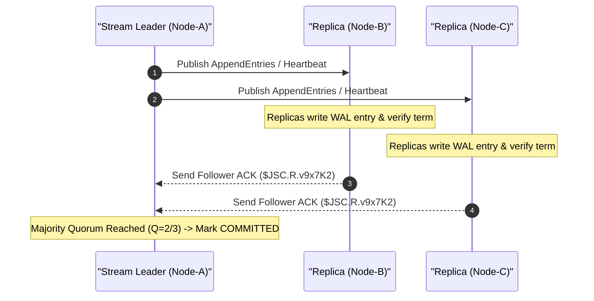
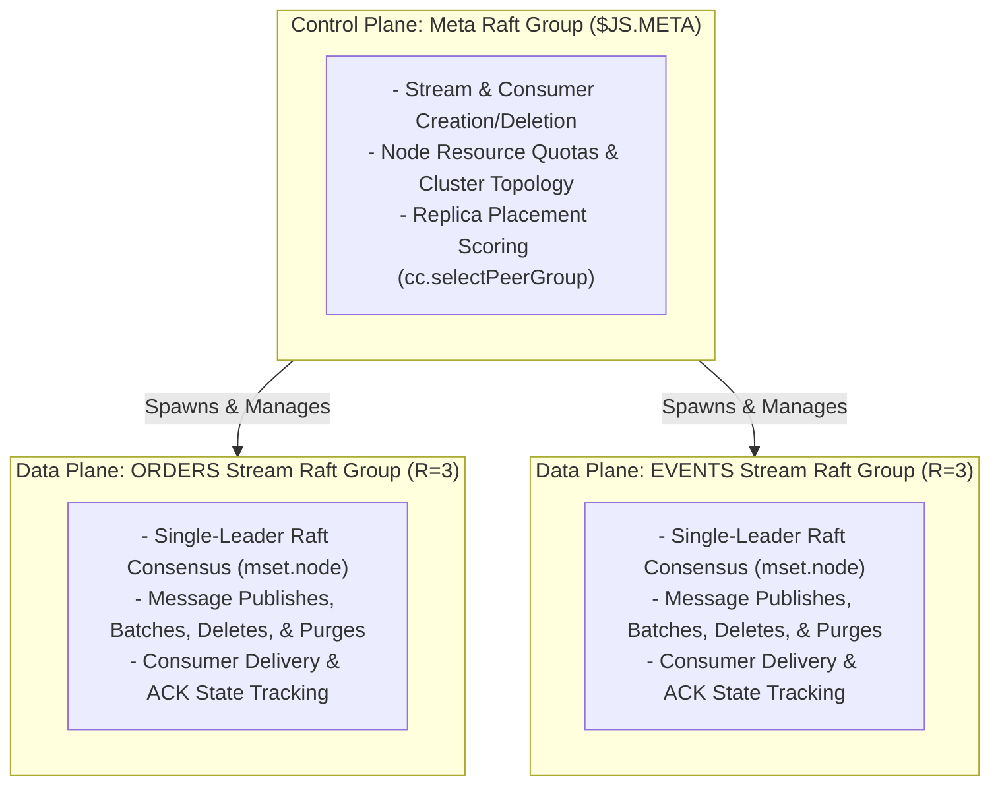

# Stream Consistency & Raft Foundations

JetStream uses single-leader Raft consensus to guarantee strong consistency across replicated streams ($R > 1$). This document details the architectural foundations of NATS JetStream consistency, including the 2-tier Raft architecture, internal transport over NATS system subjects, Raft index state management, WAL log structures, quorum mechanics, leader elections, and Go runtime entities.

---

## 1. Overview & Consensus Principles

### 1.1 What Is Consistency in NATS JetStream

In a distributed NATS cluster, stream replicas ($R > 1$) must maintain identical message sequence ordering and consumer state across multiple server nodes. NATS JetStream implements a strong consistency model based on the Raft consensus algorithm:

- **Single-Leader Model**: For each replicated stream, exactly one server node acts as the Raft Leader. All state mutations (publishes, deletes, purges, consumer ACKs) are processed through the leader.
- **Log Equivalence**: Replicas maintain identical Raft Write-Ahead Logs (WAL). Log entry order determines state machine execution order across all cluster nodes.
- **Quorum Commitment**: State updates are committed only after a majority quorum ($Q = \lfloor R/2 \rfloor + 1$) of nodes successfully append the log entry to their local storage.

---

## 2. Decoupled Transport over NATS System Subjects (`syncSubjForStream`)

In traditional distributed stores (such as Etcd or Consul), Raft consensus nodes establish dedicated peer-to-peer TCP sockets or gRPC channels. NATS JetStream uses NATS itself as the high-performance transport bus for Raft consensus messages.

### 2.1 Virtual Bus Allocation

When a stream Raft group is created, `syncSubjForStream()` generates a unique internal NATS subject prefix:

```text
$JSC.SYNC.<unique_inbox>.<node_id>
```

This subject acts as a dedicated private virtual bus for all Raft nodes assigned to host that stream.



### 2.2 Replication Protocol over System Subjects

1. **Subscription Setup**: All nodes assigned to host the stream subscribe to internal subjects matching `$JSC.SYNC.<unique_inbox>.*`.
2. **Raft Frame Packaging**: When a user publishes a message, the Stream Leader packs the Raft entry (`AppendEntries`, `VoteRequest`, `InstallSnapshot`) into a NATS binary payload.
3. **Direct System Publish**: The leader publishes the Raft RPC over NATS directly to `$JSC.SYNC.<unique_inbox>.<peer_id>`.
4. **Follower ACKs**: Followers process the Raft frame, write the entry to their local WAL, and publish a Raft response back to the leader over system reply subject `$JSC.R.<unique_inbox>`.
5. **Quorum Commitment**: Once a majority quorum ($Q = \lfloor R/2 \rfloor + 1$) ACKs over `$JSC.R`, the Stream Leader commits the entry and responds to the client.

### 2.3 Architectural Benefits

1. **Zero Additional Open Ports**: Raft replication flows through existing NATS cluster route mesh connections. No extra firewall rules or network ports are required.
2. **Location Transparency**: A Raft peer can be relocated or reassigned to any server in the cluster topology without updating network configurations -- it simply subscribes to its assigned system subject.
3. **Security & Isolation**: `$JSC` system subjects are scoped to the internal NATS System Account (`$SYS`) and are completely inaccessible to standard client connections.

---

## 3. The 2-Tier Raft System

NATS JetStream separates control plane cluster management from data plane stream processing using two distinct layers of Raft groups:



### 3.1 Meta Raft Group ($JS.META) - Control Plane

- **Scope**: Single cluster-wide Raft group formed by all JetStream-enabled servers in the cluster.
- **Leadership**: Managed by the Meta Raft Leader (`cc.meta`).
- **Responsibilities**:
  - Processes management API requests (`$JS.API.STREAM.CREATE.*`, `STREAM.DELETE`, etc.).
  - Tracks account storage limits and memory/file resource quotas across all cluster nodes.
  - Executes replica placement algorithms (`cc.selectPeerGroup`) to select nodes for new streams.
  - Commits stream assignments (`streamAssignment`) to the `$JS.META` Raft log so all nodes maintain cluster state consensus.

### 3.2 Stream Raft Groups - Data Plane

- **Scope**: Independent, dedicated Raft group spawned per stream configured with $R > 1$ (e.g., `num_replicas: 3`).
- **Leadership**: Managed by the elected Stream Leader (`mset.node`) assigned to host that specific stream.
- **Responsibilities**:
  - Replicates published messages, atomic batches, message purges, deletes, and consumer state updates.
  - Operates independently from other stream Raft groups, isolating data plane traffic per stream.

---

## 4. Core Raft Concepts & Index Tracking

Every Raft node maintains three sequence indexes to track consensus progress:

| Index Symbol | Field Name | Description |
| :--- | :--- | :--- |
| `lastIndex` | `n.last` | Sequence number of the latest entry appended to the node's local Raft WAL (`n.wal`) |
| `commitIndex` | `n.commit` | Highest entry sequence replicated to a Majority Quorum ($Q = \lfloor R/2 \rfloor + 1$) of nodes |
| `appliedIndex` | `n.applied` | Highest Raft entry sequence that has been executed into the Stream Store (`memStore` or `fileStore`) |

### Index Invariants

In a healthy operational stream replica, the sequence indexes maintain the following strict ordering invariant:

```text
appliedIndex <= commitIndex <= lastIndex
```

- **`lastIndex` advance**: Occurs as soon as the node receives and writes an `AppendEntries` payload to its local WAL (`n.wal`).
- **`commitIndex` advance**: Occurs on the leader when quorum ACKs are tallied, and on followers when notified of `commitIndex` updates by the leader.
- **`appliedIndex` advance**: Occurs asynchronously as the state machine (`applyStreamEntries`) processes committed log entries and applies them to local stream storage.

---

## 5. Raft Write-Ahead Log (WAL) & Transport Mechanics

### 5.1 Log Frame Structure

The Raft Write-Ahead Log is an append-only sequential file on disk (`n.wal`) or memory structure (`memStore`). Each log entry contains four fields:

```text
+----------------+----------------+------------------+-----------------------------+
| Index (uint64) | Term (uint64)  | Type (EntryType) | Data (Binary Payload)       |
+----------------+----------------+------------------+-----------------------------+
```

- **Index**: Monotonically increasing sequence number within the Raft group.
- **Term**: Consensus epoch during which the entry was proposed by a leader.
- **Type**: 1-byte protocol entry type (`EntryNormal`, `EntrySnapshot`, `EntryPeerState`, `EntryCatchup`, `EntryAddPeer`, `EntryRemovePeer`).
- **Data**: Binary payload. For `EntryNormal`, this contains the JetStream application header (`entryOp`) followed by operation data.

### 5.2 Physical Storage & Resilience

- **Disk Streams (`storage: "file"`)**: Log entries are appended to disk (`n.wal`). On node crash, uncommitted entries beyond `commitIndex` can be truncated, but committed entries remain durable on disk.
- **Memory Streams (`storage: "memory"`)**: Log entries are stored in RAM (`memStore`). On restart, the local WAL is lost, and the node relies on snapshot catchup from active Raft peers.

### 5.3 Network Messaging Protocols

Raft consensus protocol frames are exchanged over dedicated system subjects:

| RPC Type | Subject Pattern | Purpose |
| :--- | :--- | :--- |
| `AppendEntries` | `$SYS.RAFT.<group_id>.A` | Log entry replication & heartbeat signals |
| `VoteRequest` | `$SYS.RAFT.<group_id>.V` | Leader election vote solicitation |
| `Replies` | `$SYS.RAFT.<group_id>.AR` / `.VR` | Response frames for replication & voting |

---

## 6. Quorum & Consensus Calculations

### 6.1 Quorum Formula

Raft requires a majority quorum to elect leaders and commit log entries:

$$Q = \lfloor R/2 \rfloor + 1$$

| Replicas ($R$) | Quorum ($Q$) | Maximum Tolerated Node Failures ($F$) |
| :---: | :---: | :---: |
| 1 | 1 | 0 |
| 3 | 2 | 1 |
| 5 | 3 | 2 |

### 6.2 Fault Tolerance Limits

To tolerate $F$ node failures, a stream must be configured with at least $R = 2F + 1$ replicas. If node failures reduce active replicas below quorum $Q$, the stream enters a read-only or unavailable state, rejecting write operations with `503 No Leader Available`.

---

## 7. Leader Election & Heartbeat Dynamics

### 7.1 Campaign Execution

When a node initiates a leadership election (transition to Candidate state):

1. **Term Increment**: Increments its current consensus term (`term++`).
2. **Self Vote**: Votes for itself (`vote = candidateID`) and persists the vote to disk/memory.
3. **Vote Request Broadcast**: Broadcasts `voteRequest(term, pterm, pindex, candidateID)` to all Raft group peers.
4. **Peer Voting Logic**: A peer grants its vote if:
   - Candidate term $\ge$ peer current term.
   - Peer has not voted for another candidate in this term.
   - Candidate log is at least as up-to-date as the peer's log (`lastTerm` and `lastIndex`).
5. **Election Victory**: If votes $\ge Q$, the candidate transitions to Leader (`switchToLeader()`) and broadcasts `sendPeerState` to announce leadership and synchronize peer topology.

### 7.2 Heartbeats & Liveness

- **Heartbeat Interval**: The active leader periodically (every 1 second) broadcasts `sendHeartbeat()` (an empty `AppendEntries` frame).
- **Follower Election Timer**: Followers reset their randomized election timer (1.5s - 3.0s) upon receiving any valid `AppendEntries` or heartbeat frame.
- **Quorum Verification**: The leader periodically checks `lostQuorumLocked()`. If a majority of peers fail to ACK heartbeats, the leader voluntarily steps down (`stepdown`) to prevent split-brain scenarios.

### 7.3 Re-Election Pathways

#### Voluntary Stepdown (Graceful / `CampaignImmediately`)

- The existing leader picks the healthiest, most up-to-date follower node.
- The leader sends an `EntryLeaderTransfer(peerID)` log entry directly to the cluster and steps down.
- The nominated peer receives the entry, skips the election timer wait, and invokes `CampaignImmediately()` (10ms timer) to become the new leader fast.

#### Unplanned Node Failure (Crash / Partition)

- Leader crashes or is partitioned; heartbeats stop.
- Followers' election timers count down independently.
- The follower whose election timer expires first transitions to Candidate and calls `Campaign()`.
- Upon receiving majority votes, it becomes the new Raft Leader and resumes message replication.

---

## 8. Go Runtime Core Entities

Inside the `nats-server` codebase, stream consistency and cluster orchestration are managed by four core Go structures:

```text
s (*Server) -- Node Level Daemon
  |
  +-- acc (*Account) -- Multi-tenant Boundary
  |     |
  |     +-- jsa (*jsAccount) -- Account Storage Quotas & Stream Lookup
  |
  +-- js (*jetStream) -- Node-Local JetStream Engine
        |
        +-- cc (*jetStreamCluster) -- Cluster Controller
              |
              +-- cc.meta (*raftNode) -- Participant in $JS.META Group
```

### 8.1 Entity Descriptions

1. **`s (*Server)`**: Represents the single `nats-server` process daemon. Owns TCP client listeners, server options, route mesh sockets, and the `s.js` pointer.
2. **`acc (*Account)`**: Represents a multi-tenant account boundary (e.g., `$SYS`, `PAYMENTS`). Holds authorization rules, user limits, and local stream lookups.
3. **`js (*jetStream)`**: The local JetStream subsystem controller running on the server node. Manages storage engines and contains the cluster controller pointer (`js.cluster`).
4. **`cc (*jetStreamCluster)`**: The cluster controller present on every JetStream-enabled server node. Holds `cc.meta` (this node's local participant instance in the Meta Raft Group `$JS.META`).

### 8.2 Checking Leader Status

To determine if the local server node is the active Meta Raft Leader, NATS executes:

```go
if cc.isLeader() {
    // This server node is the Meta Raft Leader (Control Plane Leader)
}
```

To determine if the local node is the active Stream Raft Leader for a specific stream:

```go
if mset.isLeader() {
    // This server node is the Stream Raft Leader for this stream
}
```
