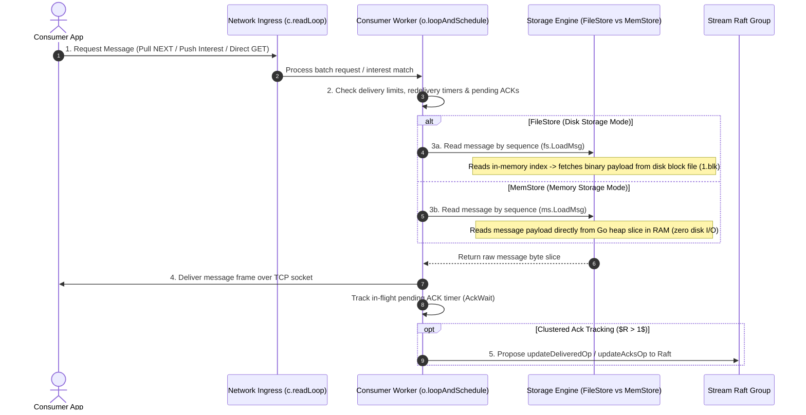

# End-to-End Read Path Architecture

The NATS JetStream read path connects client consumer applications to stream storage engines and delivery workers. Reads can occur via push delivery, pull consumer batch fetches, or high-performance direct GET requests. While consumer state tracking and interest matching are storage-agnostic, message payload retrieval and performance characteristics adapt based on the stream's storage backend (**`FileStore` vs `MemStore`**).

---

## 1. Triggers & Client Ingress

Message reads from a JetStream stream can be initiated through three distinct pathways:

### 1.1 Trigger Comparison & Ingress Characteristics

| Trigger Pathway | Initiator | Protocol / Subject | Operational Processing |
| :--- | :--- | :--- | :--- |
| **Push Consumer Delivery** | Server Worker Loop | Server proactively pushes matching stream messages to client subject | Managed by consumer delivery goroutines (`o.loopAndScheduleMsgDelivery()`) based on subject interest |
| **Pull Consumer Fetch** | Client App | `$JS.API.CONSUMER.MSG.NEXT.<stream>.<consumer>` JSON request | Client requests a batch of $N$ messages or bytes; consumer processes pending request (`o.processNextMsgRequest()`) |
| **Direct Get API** | Client App / KV | `$JS.API.STREAM.MSG.GET.<stream>` / `Nats-Expected-Last-Subject-Sequence` | Bypasses consumer tracking and Raft consensus loops for lockless direct message retrieval from storage |

---

## 2. Layer 1: High-Level Conceptual Flow & Working Principles

### 2.1 Core Architectural Working Principles

1. **Strict Commit Boundary Read Isolation**: Consumers can **ONLY read committed messages** ($seq \le commitIndex$). Uncommitted messages sitting in the Raft WAL (`n.wal`) are strictly invisible to all consumers.
2. **Decoupled Consumer State Machine**: Each consumer maintains independent sequence pointers (`sseq` for stream sequence, `dseq` for consumer sequence). A single stream message can be read simultaneously by hundreds of independent consumers without data duplication.
3. **Storage Engine Divergence in Phase 3**:
   - **`FileStore` (Disk)**: `fs.LoadMsg()` uses an in-memory sparse index to resolve sequence number to byte offset within active or archived block files (`1.blk`). Frequently accessed messages are served from the OS page cache; cold reads incur physical disk IOPS.
   - **`MemStore` (Memory)**: `ms.LoadMsg()` retrieves message byte arrays directly from Go heap slice references in RAM. Delivers sub-millisecond read latency with zero disk I/O; bound by memory bus speed and network interface card (NIC) throughput.
4. **Direct GET Lockless Optimization (`AllowDirect`)**: Key-Value (KV) stores and direct message APIs bypass Raft consensus, consumer delivery queues, and heavy locks, serving message payloads directly from storage (`mset.getDirectRequest()`).
5. **Asynchronous ACK Tracking**: Message delivery and client ACKs trigger background Raft state updates (`updateDeliveredOp` / `updateAcksOp`), ensuring consumer state is replicated across cluster nodes without blocking active delivery loops.

---

## 3. Layer 2: Go Runtime Implementation Mechanics

This section maps the 4-phase read pipeline directly to `nats-server` Go source files, goroutine boundaries, structures, and function calls.

### 3.1 Phase 1: Network Ingress & Request Parsing

- **Primary Source Files**: `server/client.go` & `server/consumer.go`
- **Execution Context**: Client Connection Read Loop Goroutine (`c.readLoop()`) / API Handler

1. **Request Ingress**: `c.readLoop()` parses incoming client requests (`$JS.API.CONSUMER.MSG.NEXT.<stream>.<consumer>`).
2. **Batch Request Processing**: `c.processNext()` parses requested batch size ($N$ messages or $B$ bytes) and expires timers (`expires`).
3. **Consumer Association**: Resolves request to consumer object `o (*consumer)`.
4. **Queue Pending Request**: `o.processNextMsgRequest()` appends request to consumer pending queue `o.mreqs`.

### 3.2 Phase 2: Consumer State Machine & Interest Filtering

- **Primary Source File**: `server/consumer.go`
- **Execution Context**: Dedicated Consumer Delivery Goroutine (`o.loopAndScheduleMsgDelivery()`)

1. **Next Sequence Selection**: Consumer checks its current stream sequence pointer `o.sseq`.
2. **Subject Interest Filtering**: If consumer has a subject filter (`cfg.FilterSubject`), `mset.csl.Match()` filters stream messages matching the subject pattern.
3. **Delivery & Rate Guard Checks**: Verifies `o.maxAckPending` limits, `o.maxDeliver` retries, and active `AckWait` timers before proceeding to storage fetch.

### 3.3 Phase 3: Storage Engine Retrieval

- **Primary Source Files**: `server/filestore.go`, `server/memstore.go` & `server/stream.go`
- **Execution Context**: Consumer Delivery Goroutine / Direct GET Worker

1. **Sequence Fetch Call**: Consumer calls `mset.store.LoadMsg(seq, &smv)`.
2. **Storage Retrieval Execution**:
   - **`FileStore` Mode**: Calls `fs.LoadMsg()` (`server/filestore.go`). Searches in-memory index for sequence offset, reads record from block segment (`1.blk`), verifies CRC checksum, and returns headers and payload byte slice.
   - **`MemStore` Mode**: Calls `ms.LoadMsg()` (`server/memstore.go`). Dereferences in-memory Go slice pointer, copying header and payload byte slices directly from RAM.
3. **Direct GET Shortcut (`AllowDirect`)**: If request is a Direct GET, `mset.getDirectRequest()` (`server/stream.go`) executes `fs.LoadMsg()` or `ms.LoadMsg()` directly, skipping consumer state machine locks completely.

### 3.4 Phase 4: Delivery, ACK Tracking & Cluster State Replication

- **Primary Source Files**: `server/consumer.go`, `server/stream.go` & `server/jetstream_cluster.go`
- **Execution Context**: Client Connection Egress Goroutine + Raft Apply Loop

1. **Network Frame Egress**: Server constructs NATS protocol message frame containing stream headers (`Nats-Stream`, `Nats-Sequence`, `Nats-Last-Sequence`) and payload, writing to client TCP socket (`c.writeRaw()`).
2. **In-Flight ACK Tracking**: `o.trackPending()` records the delivered sequence in `o.pending` map and arms the `AckWait` timer.
3. **Client ACK Processing**: When client sends ACK (`+ACK`), `o.processAck()` clears sequence from `o.pending` map and advances consumer sequence `o.ackSeq`.
4. **Cluster State Replication ($R > 1$)**: Consumer pushes `updateDeliveredOp` or `updateAcksOp` to stream Raft group (`mset.node.Propose()`), replicating consumer progress across cluster replicas.

---

## 4. Operational & Performance Impact During Operation

| Operational Dimension | `FileStore` (Disk Storage Mode) | `MemStore` (Memory Storage Mode) |
| :--- | :--- | :--- |
| **Read Latency** | **Microsecond (Hot Page Cache) to Millisecond (Cold Disk)**; Bounded by OS page cache hit ratio, disk read IOPS, and NVMe read latency | **Sub-Millisecond (Ultra Low)**; Pure RAM dereferencing; zero disk read latency |
| **Read Throughput** | **High (Page Cache Bound)**; Sequential reads scale with kernel page cache size; cold random reads bound by disk read bandwidth | **Ultra High (RAM Bus Bound)**; Scales with CPU memory bus bandwidth and NIC throughput |
| **Primary System Bottleneck**| **Disk Read IOPS & Kernel Page Cache Size** | **Network Interface (NIC) Bandwidth & RAM Bus Speed** |
| **Memory Footprint** | **Low Go Heap / High OS Page Cache**; Messages read via disk buffers without bloating Go garbage collector (GC) heap | **High Go Heap**; Active reads dereference RAM slices, maintaining memory pressure on Go GC |
| **Direct GET Performance** | **High**; Direct index lookup bypassing consumer locks; served from OS page cache | **Ultra High**; Lockless direct RAM slice access; delivers maximum GET throughput |
| **Post-Restart Read Availability** | **Immediate**; Reads available instantly upon server startup by reading existing disk block files (`1.blk`) | **Delayed**; Reads unavailable until target node completes 100% full stream re-replication over network |