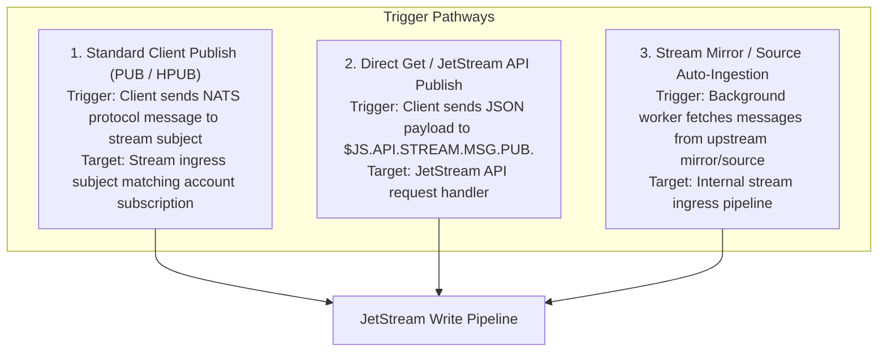
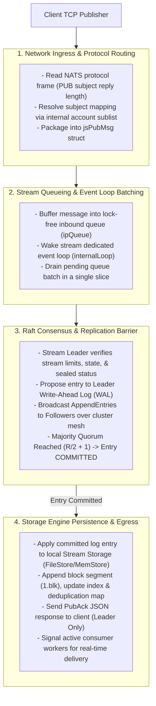
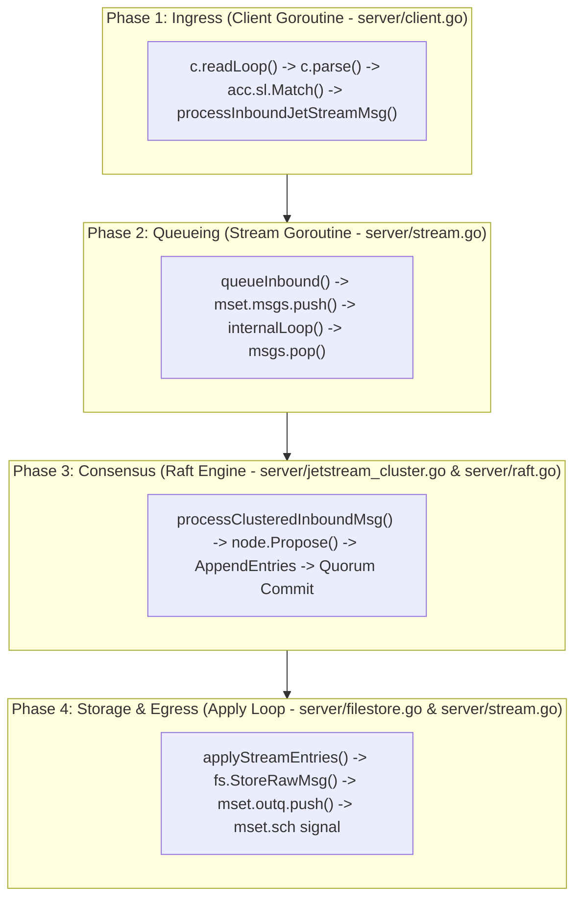

# End-to-End Write Path Architecture

The NATS JetStream write path connects client TCP publishers to distributed Raft consensus replicas and disk-backed storage engines. This document details the trigger pathways, high-level conceptual flow, Go runtime mechanics, and operational performance characteristics across the end-to-end write pipeline.

---

## 1. Triggers & Client Ingress

Message writes into a JetStream stream can be initiated through three distinct pathways:

### 1.1 Trigger Comparison & Ingress Characteristics

| Trigger Pathway | Initiator | Protocol / Subject | Operational Processing |
| :--- | :--- | :--- | :--- |
| **Standard Client Publish** | Client App | Core NATS `PUB` / `HPUB` to stream subject | Handled via account sublist routing directly to stream inbound queue |
| **JS API Publish** | Client App | `$JS.API.STREAM.MSG.PUB.<stream>` JSON request | Validated by API handler, converted to `jsPubMsg`, and queued into stream |
| **Mirror / Source Ingestion** | Background Fetch Loop | Internal system subscription on upstream stream | Internal worker fetches upstream messages and pushes directly to inbound queue |

---

## 2. Layer 1: High-Level Conceptual Flow & Working Principles

### 2.1 Core Architectural Working Principles

1. **Decoupled Network Ingress & Storage Processing**: Network connection goroutines do not write directly to disk or wait synchronously for Raft consensus under lock. They buffer messages into an inbound stream queue (`ipQueue`) and return immediately to service TCP sockets.
2. **Single-Goroutine Event Loop & Automatic Batching**: Each stream runs a single event loop (`internalLoop()`) that drains all accumulated messages from the queue in a single slice. Under heavy load, this automatically converts individual publishes into bulk batch proposals, drastically reducing lock contention and I/O operations.
3. **Strict Post-Consensus State Mutation**: Storage writes (`FileStore` / `MemStore`) occur **only AFTER majority quorum consensus ($Q = \lfloor R/2 \rfloor + 1$) is achieved**. Uncommitted Raft log entries are never written into primary stream data files.
4. **Leader-Only Egress & Follower Silence**: Only the active Raft Leader constructs and flushes `PubAck` responses to client publishers over TCP. Follower nodes replicate the WAL and execute state machine writes silently.
5. **Decoupled Consumer Signals**: Stream persistence signals consumer delivery workers asynchronously (`mset.sch` / `mset.sigq`), waking pull/push consumers without delaying publisher acknowledgements.

---

## 3. Layer 2: Go Runtime Implementation Mechanics

This section maps the 4-phase write pipeline directly to `nats-server` Go source files, goroutine boundaries, structures, and function calls.

### 3.1 Phase 1: Network Ingress & Protocol Parsing

- **Primary Source File**: `server/client.go`
- **Execution Context**: Client Connection Read Loop Goroutine (`c.readLoop()`)

1. **TCP Frame Read**: `c.readLoop()` reads raw NATS protocol bytes from the client TCP connection (`net.Conn`).
2. **Protocol Parsing**: `c.parse()` parses protocol tokens (`PUB <subject> [reply-to] <bytes>\r\n<payload>\r\n`).
3. **Subject Match**: NATS account sublist router (`acc.sl.Match()`) matches the published subject against the stream's internal system subscription.
4. **Inbound Callback**: Invokes the stream's inbound message callback `processInboundJetStreamMsg()`.

### 3.2 Phase 2: Stream Event Loop & Inbound Queueing

- **Primary Source File**: `server/stream.go`
- **Execution Context**: Handed off from Client Goroutine to Stream Dedicated Goroutine

1. **Message Envelope Packaging**: `processInboundJetStreamMsg()` constructs a `jsPubMsg` struct containing message payload, headers, subject, arrival timestamp, and client reply inbox.
2. **Queue Push**: `queueInbound()` calls `mset.msgs.push(jsMsg)` (`server/ipqueue.go`). If the queue was empty, a signal (`struct{}{}`) is pushed to `msgs.ch`.
3. **Event Loop Wake**: The stream's single dedicated event loop (`internalLoop()`) unblocks at `case <-msgs.ch:`.
4. **Batch Slice Drain**: `internalLoop()` calls `ims := msgs.pop()`, draining **all pending messages from the queue in a single slice** for bulk processing.

### 3.3 Phase 3: Raft Proposal & Quorum Consensus

- **Primary Source Files**: `server/jetstream_cluster.go` & `server/raft.go`
- **Execution Context**: Stream `internalLoop` Goroutine + Raft Node Goroutines

1. **Leader Verification & Guard Checks**: `processClusteredInboundMsg()` verifies `mset.isLeader() == true` and validates stream limits (`MaxBytes`, `MaxMsgSize`, sealed status).
2. **Opcode Serialization**: Prepends the 1-byte opcode (`streamMsgOp`) and serializes message payload and headers into an `esm` binary buffer.
3. **Raft Proposal**: Calls `node.Propose(term, esm)` (`server/jetstream_batching.go`), appending the entry to the Leader's local Raft WAL (`n.wal`) as uncommitted.
4. **Replication Broadcast**: The Leader broadcasts `AppendEntries` RPCs containing log entry $I$ over `$SYS.RAFT.<group_id>.A` to all follower replicas.
5. **Follower WAL Append**: Followers append entry $I$ to their local `n.wal` as uncommitted and reply with ACKs over `$SYS.RAFT.<group_id>.AR`.
6. **Quorum Commit**: When ACKs reach Majority Quorum ($Q = \lfloor R/2 \rfloor + 1$), the Leader advances its commit index (`commitIndex = I`). Entry $I$ is now **COMMITTED**.

### 3.4 Phase 4: Storage Engine Persistence & Egress

- **Primary Source Files**: `server/filestore.go` & `server/stream.go`
- **Execution Context**: Raft Apply Loop Goroutine (`applyStreamEntries`) on ALL quorum nodes

1. **Apply Channel Consumption**: The Raft engine notifies `applyStreamEntries()` -> `applyStreamMsgOp()` -> `processJetStreamMsg()`.
2. **Storage Engine Write**: Calls `fs.StoreRawMsg()` (`server/filestore.go`):
   - **Block Segment Write**: Appends binary record `[magic | sequence | timestamp | subject_len | hdr_len | payload_len | payload]` to active block file (e.g., `1.blk`).
   - **Sparse Index Update**: Updates in-memory index mapping sequence to file offset and updates subject tree state (`psim`).
   - **Deduplication Map**: Updates `mset.ddmap` for `Nats-Msg-Id` duplicate tracking.
3. **Outbound PubAck (Leader Only)**: Only the Raft Leader constructs `PubAck` JSON `{"stream":"ORDERS","seq":101}` and pushes it to `mset.outq` (`ipQueue`), flushing over TCP back to the client socket.
4. **Consumer Notification Signal**: The stream pushes a signal to `mset.sch` / `mset.sigq` (`server/stream.go`), waking JetStream consumer delivery workers to deliver the message to subscribers.

---

## 4. Operational & Performance Impact During Operation

| Operational Dimension | Impact Level | Detailed Behavioral Characteristics |
| :--- | :--- | :--- |
| **Ingress Throughput** | High / Scalable | Ingress connection goroutines push into `ipQueue` without waiting on disk I/O, preventing socket backpressure |
| **Write Batching Efficiency** | Dynamic / High | `internalLoop()` automatically drains accumulated queue slices in a single batch under high load, scaling I/O efficiency |
| **Consensus Latency** | Majority Quorum | Client write ACK latency is bounded by the fastest majority quorum ($Q = \lfloor R/2 \rfloor + 1$) network round trip |
| **Storage Safety** | Guaranteed | Zero uncommitted Raft entries reach primary `FileStore` files (`1.blk`); storage writes only execute after quorum commit |
| **Egress Overhead** | Minimal (Leader Only) | Follower nodes remain silent while the active Raft Leader handles client `PubAck` responses and consumer dispatch signals |