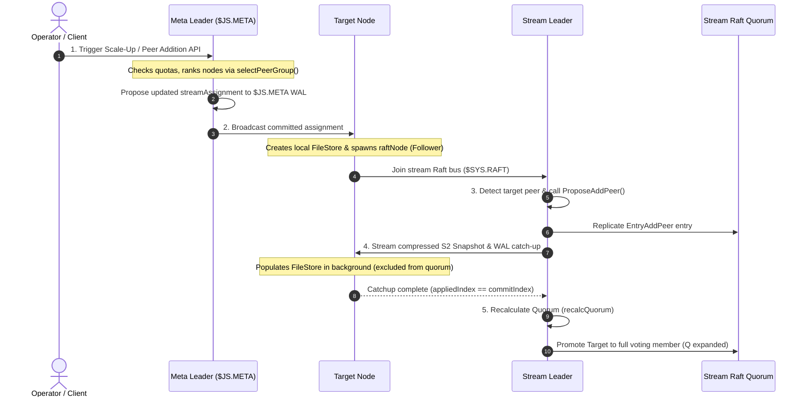

# Adding New Nodes & Stream Replica Scaling

Adding new nodes or scaling up stream replicas in NATS JetStream allows clusters to expand fault tolerance ($R > 1$) and automatically recover from node failures. This document details the trigger pathways, high-level conceptual flow, Go runtime mechanics, and operational performance impact during node addition.

---

## 1. Triggers & Operator Actions

Stream replica scale-up or peer addition can be initiated through three distinct pathways:

| Trigger Pathway | Initiator | Required Operator Action | Operational Outcome |
| :--- | :--- | :--- | :--- |
| **Manual Scale-Up** | Client / Operator | Run `nats stream update <stream> --replicas=N` or issue API update | Increases stream replication factor and selects optimal candidate nodes across cluster |
| **Manual Peer Addition** | Operator | Run `nats stream cluster peer add <stream> <node_id>` | Directs replica allocation to a specific target node |
| **Auto Self-Healing** | Meta Leader (`$JS.META`) | **Zero operator action required** | Meta Leader automatically detects node death, allocates replacement node, and restores replica count |

---

## 2. Layer 1: High-Level Conceptual Flow & Working Principles

### 2.1 Working Principles

- **Non-Blocking Catch-up**: The catching-up node receives stream snapshot data in the background while the active Stream Leader continues processing live client publishes without interruption.
- **Quorum Isolation (`catchupPeers`)**: Target nodes starting with empty storage (`pindex = 0`) are placed into an isolated catch-up pool and strictly excluded from quorum voting. This prevents lagging nodes from delaying client publishes or reducing write availability.
- **S2 Snapshot Compression**: Snapshot data is compressed using S2 compression before transmission over internal system subjects (`$SYS.RAFT.<group_id>.A`).
- **Dynamic Quorum Expansion**: Quorum size ($Q = \lfloor R/2 \rfloor + 1$) expands only after data synchronization completes (`appliedIndex == commitIndex`), promoting the node to a full voting member.

---

## 3. Layer 2: Go Runtime Implementation Mechanics

### 3.1 Step 1: Ingress & Meta Assignment

- **Primary Source File**: `server/jetstream_cluster.go`
- **Function**: `s.jsClusteredStreamUpdateRequestLocked()`
- **Goroutine Context**: API Handler Goroutine

1. Detects scale-up condition (`newCfg.Replicas > len(currentPeers)`).
2. Verifies account storage quotas via `js.jsClusteredStreamLimitsCheck()`.
3. Invokes `cc.selectPeerGroup(newCfg.Replicas, ...)` to rank candidate nodes based on available disk/memory, liveness, and placement anti-affinity rules (`uniqueTag`).
4. Wraps target nodes in `rg.withDesired(newRaftGroup)`.
5. Calls `meta.Propose(encodeUpdateStreamAssignment(sa))` to commit the assignment into the `$JS.META` Raft log.

### 3.2 Step 2: Target Node Processing & Local Init

- **Primary Source File**: `server/jetstream_cluster.go`
- **Function**: `js.processStreamAssignment()`
- **Goroutine Context**: Target Server `$JS.META` Apply Loop Goroutine

1. Target node receives the committed `streamAssignment` frame from `$JS.META`.
2. Invokes `js.createStream()` -> `mset.store.Store()` to create local `FileStore` directory on disk.
3. Spawns `mset.node` (Raft node) via `s.createRaftNode()` in **Follower State**.
4. Subscribes to internal stream Raft subjects (`$SYS.RAFT.<group_id>.A` / `$JSC.SYNC.*`).

### 3.3 Step 3: Stream Leader Peer Addition (`ProposeAddPeer`)

- **Primary Source Files**: `server/jetstream_cluster.go` & `server/raft.go`
- **Function**: `runStreamMigration()` -> `s.selectPeerToAdd()` -> `n.ProposeAddPeer(add)`
- **Goroutine Context**: Stream Leader `internalLoop()` / Migration Worker

1. Stream Leader detects the target node listening on Raft system subjects.
2. Calls `n.ProposeAddPeer(add)` (`server/raft.go`).
3. Appends an `EntryAddPeer` log entry to its local WAL (`n.wal`) and replicates to current quorum nodes.
4. Once committed, all group members update their internal `n.peers[newNodeID]` membership map.

### 3.4 Step 4: Snapshot Stream Sync & Non-Blocking Catch-up

- **Primary Source Files**: `server/jetstream_cluster.go` & `server/raft.go`
- **Function**: `calculateSyncRequest()` -> `n.SendSnapshot()` -> `InstallSnapshot()`
- **Goroutine Context**: Stream Leader Sync Worker Goroutine -> Target Node Catchup Worker

1. Because the target node starts with `pindex == 0`, the Leader calculates sync bounds via `calculateSyncRequest()`.
2. Leader streams compressed snapshot blocks over `$SYS.RAFT.<group_id>.A`.
3. Target node calls `InstallSnapshot()`, creating block files (`1.blk`) and populating local `FileStore`.
4. Target node is tracked in `mset.catchupPeers()` and **excluded from quorum voting**.

### 3.5 Step 5: Quorum Expansion (`recalcQuorum`)

- **Primary Source File**: `server/raft.go`
- **Function**: `n.recalcQuorum()`
- **Goroutine Context**: Stream Leader Raft Loop

1. Target node's `appliedIndex` catches up to Leader's `commitIndex`.
2. Leader removes target node from `catchupPeers` list.
3. Leader calls `n.recalcQuorum()`, expanding `n.qn = n.csz/2 + 1` (e.g., $Q = 1 \rightarrow 2$).
4. Target node becomes a full voting member of the stream cluster.

---

## 4. Operational & Performance Impact During Operation

| Operational Dimension | Impact Level | Detailed Behavioral Characteristics |
| :--- | :--- | :--- |
| **Client Publish Latency** | Zero Impact | Catching-up node is placed in `catchupPeers` and strictly excluded from quorum voting; client writes continue to be committed by existing active quorum without delay |
| **Network Bandwidth** | Moderate to High | Leader streams compressed S2 snapshot chunks over `$SYS.RAFT.<group_id>.A` to target node; throughput is bounded by network RTT and socket buffer limits |
| **Leader CPU Utilization** | Low to Moderate | Leader compresses snapshot blocks in background goroutines using S2 compression before wire transmission |
| **Leader Disk I/O** | Controlled / Low | Leader reads stored block segments (`1.blk`) sequentially from disk; disk semaphores prevent catch-up reads from starving client write I/O |
| **Quorum Availability** | Unaffected | Active quorum size ($Q$) remains unchanged until catch-up completes, preserving write availability throughout synchronization |
| **Memory Headroom** | Minimal | Target node streams snapshot chunks directly to disk (`1.blk`) via `InstallSnapshot()`, preventing heap allocation spikes |