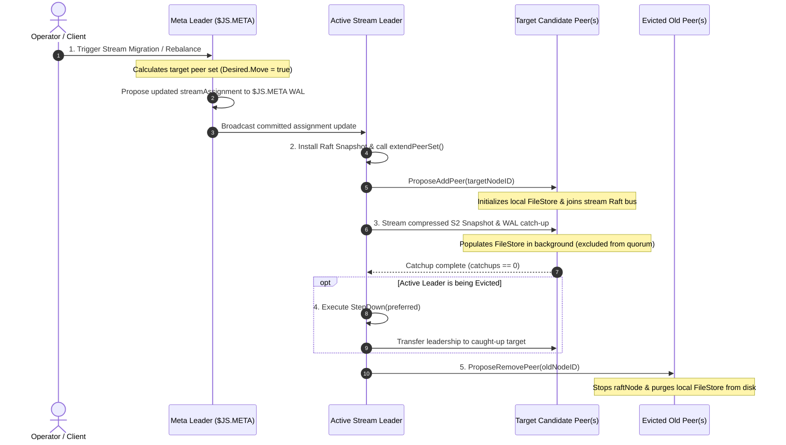

# Stream Balancing & Peer Migration Operations

Stream balancing and peer migration in NATS JetStream allows operators or cluster self-healing mechanisms to rebalance stream replicas across cluster nodes, evacuate streams from degrading hardware, or adjust stream placement according to tag rules. This document details the trigger pathways, high-level conceptual flow, Go runtime mechanics, and operational performance impact during stream balancing and migration.

---

## 1. Triggers & Operator Actions

Stream balancing or migration can be initiated through three distinct pathways:

### 1.1 Trigger Comparison & Required Operator Actions

| Trigger Pathway | Initiator | Required Operator Action | Operational Outcome |
| :--- | :--- | :--- | :--- |
| **Manual Migration** | Operator / CLI | Run `nats stream cluster peer migrate` or `nats stream cluster peer balance` | Reallocates stream replicas to target node set or rebalances replicas across cluster |
| **Placement Tag Update** | Operator | Update `Placement.Tags` in stream configuration | Re-homes stream replicas onto cluster nodes matching updated tags |
| **Auto Self-Healing** | Meta Leader (`$JS.META`) | **Zero operator action required** | Automatically detects node evacuation/drain or imbalance and migrates stream replicas |

---

## 2. Layer 1: High-Level Conceptual Flow & Working Principles

### 2.1 Working Principles

- **Phased Overlap Expansion**: The stream peer set temporarily expands from existing peers to the combined peer set while target nodes catch up, ensuring the stream is never under-replicated.
- **Strict Quorum Protection during Migration**: Old nodes continue serving quorum votes while target nodes download snapshots in the background. Old nodes are only evicted after target nodes are 100% caught up.
- **Single Inflight Reconfiguration Guard (`osa.moveInFlight()`)**: NATS strictly forbids overlapping move or scale operations per stream to prevent cluster state drift.
- **Zero-Downtime Leadership Transition**: If the active Stream Leader itself is being migrated, it executes `StepDown(preferred)` to hand over leadership to a caught-up target replica *before* evicting old nodes.

---

## 3. Layer 2: Go Runtime Implementation Mechanics

### 3.1 Step 1: Ingress & Meta Desired State Proposal

- **Primary Source File**: `server/jetstream_cluster.go`
- **Function**: `s.jsClusteredStreamUpdateRequestLocked()`
- **Goroutine Context**: API Handler Goroutine

1. Detects `isMoveRequest == true`.
2. Calls `cc.selectPeerGroup()` to select new candidate target nodes based on disk/memory availability, liveness, and placement tags.
3. Wraps target peer set into `rg = osa.Group.withDesired(rg)` with `rg.Desired.Move = true`.
4. Calls `meta.Propose(encodeUpdateStreamAssignment(sa))` to commit the assignment into the `$JS.META` Raft log.

### 3.2 Step 2: Stream Migration Runner & Snapshot Installation (`js.runStreamMigration`)

- **Primary Source File**: `server/jetstream_cluster.go`
- **Function**: `js.runStreamMigration()`
- **Goroutine Context**: Stream Leader Worker Goroutine

1. Stream Leader reads `sa.Group.desiredSnapshot(leaderTerm)`.
2. Verifies `n.NeedSnapshot()`. Flushes pending writes (`mset.flushAllPending()`) and installs snapshot via `n.InstallSnapshot(mset.stateSnapshot(), true)`.
3. Calls `s.extendPeerSet(n, ...)` -> `n.ProposeAddPeer(add)` to add target candidate nodes to the Raft group.

### 3.3 Step 3: Background Catch-up & Quorum Guard (`mset.catchupPeers`)

- **Primary Source File**: `server/jetstream_cluster.go`
- **Function**: `mset.catchupPeers()`
- **Goroutine Context**: Sync Worker Goroutines

1. Target node is tracked in `catchups := mset.catchupPeers()`.
2. Leader streams compressed S2 snapshot blocks over `$SYS.RAFT.<group_id>.A`.
3. `runStreamMigration()` delays peer eviction while `len(catchups) > 0`.

### 3.4 Step 4: StepDown & Old Peer Eviction (`s.removeEvictedPeers`)

- **Primary Source File**: `server/jetstream_cluster.go`
- **Function**: `s.removeEvictedPeers()`
- **Goroutine Context**: Stream Leader Worker Goroutine

1. Once `catchups` is empty, `removeEvictedPeers()` identifies old nodes no longer in `desiredPeers`.
2. If the Leader itself is being evicted, it calls `n.StepDown(preferred)` to hand over leadership first.
3. Calls `n.ProposeRemovePeer(remove)` to evict old nodes one by one.
4. Evicted node receives notification, stops `raftNode`, and purges its local `FileStore` directory from disk (`mset.store.Delete()`).

---

## 4. Operational & Performance Impact During Operation

| Operational Dimension | Impact Level | Detailed Behavioral Characteristics |
| :--- | :--- | :--- |
| **Client Publish Availability** | Zero Downtime | Client publishes continue normally; active quorum processes ACKs while target nodes catch up |
| **Network Bandwidth** | Temporary Spike | Snapshot data transfer to target nodes generates temporary network traffic on system subjects (`$SYS.RAFT`) |
| **Disk & Memory Overhead** | Temporary Allocation | Stream data is briefly duplicated across old and target nodes during migration until old nodes are evicted |
| **Leadership Transition** | Zero Message Loss | If the leader node is being migrated, it executes `StepDown(preferred)` before eviction, preventing publisher errors |
| **Reconfiguration Safety** | Single Guard | `moveInFlight()` prevents concurrent move or scale operations per stream to prevent state drift |