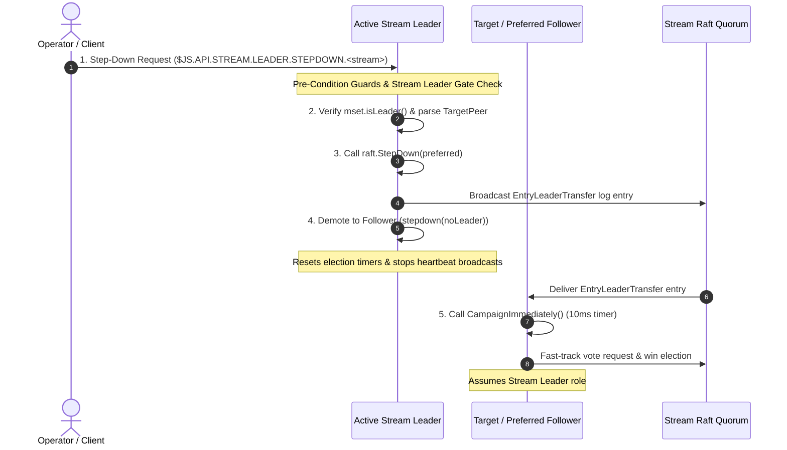

# Stream Leader Step-Down Operations

A client or operator requests leadership transfer for a specific stream by publishing an API request to `$JS.API.STREAM.LEADER.STEPDOWN.<stream_name>`. The current Stream Leader validates the request, resolves the target peer, and delegates to the Raft consensus layer to execute a fast-track leadership transfer. This document details trigger pathways, high-level conceptual flow, Go runtime mechanics, and operational performance impact during leader stepdown.

---

## 1. Triggers & Operator Actions

Stream leadership stepdown can be initiated through three distinct pathways:

### 1.1 Trigger Comparison & Required Operator Actions

| Trigger Pathway | Initiator | Required Operator Action | Operational Outcome |
| :--- | :--- | :--- | :--- |
| **Manual Step-Down** | Operator / Client | Run `nats stream cluster step-down <stream> [--peer target]` | Initiates fast-track leadership transfer to target peer or optimal follower |
| **Storage / Quorum Failure** | Server Engine | **Zero operator action required** | Automatically demotes faulty leader on disk error or quorum loss to protect stream consistency |
| **Stream Evacuation / Shutdown** | Operator / System | Run node evacuation command or issue server shutdown signal | Automatically executes graceful `StepDown` before node shutdown to prevent election delays |

---

## 2. Layer 1: High-Level Conceptual Flow & Working Principles

### 2.1 Working Principles

- **Graceful Fast-Track Transfer**: Unlike unplanned node crashes that rely on full election timeouts (1.5s - 3.0s), stepdown uses `EntryLeaderTransfer` and `CampaignImmediately()` (10ms timer) to complete leadership transfer in ~10ms - 50ms.
- **Leader Gate & Follower Silence**: Stepdown requests sent to follower nodes are silently dropped. Official client SDKs automatically route requests across the NATS mesh to the active leader.
- **Preferred Peer Override**: If a specific target node is specified (`--peer nats-2`), the leader verifies that peer's health (heartbeat ACK within 3s). If healthy, leadership is transferred directly to the requested node.
- **Automatic Fallback on Disk / Quorum Loss**: If a node suffers disk write errors or loses connection to quorum, it demotes immediately to follower state to prevent stale split-brain writes.

---

## 3. Layer 2: Go Runtime Implementation Mechanics

### 3.1 Step 1: Pre-Condition Guards & Ingress

- **Primary Source File**: `server/jetstream_cluster.go`
- **Function**: `jsStreamLeaderStepDownRequest()`
- **Goroutine Context**: API Handler Goroutine

1. Verifies JetStream is enabled and server is clustered (`JSClusterRequiredError`).
2. Checks `$JS.META` Meta Leader availability (`JSClusterNotAvailError`).
3. Resolves target account and verifies stream assignment exists.
4. Checks stream Raft group quorum liveness (`JSClusterNotAvailError`).

### 3.2 Step 2: Stream Leader Gate & Target Parsing

- **Primary Source File**: `server/jetstream_cluster.go`
- **Function**: `jsStreamLeaderStepDownRequest()`
- **Goroutine Context**: API Handler Goroutine

1. Checks `mset.isLeader()`. If false, exits silently (followers ignore request).
2. Resolves local stream instance `mset`.
3. Parses optional `TargetPeer` parameter from JSON payload if specified.

### 3.3 Step 3: Raft Leadership Transfer (`raft.StepDown`)

- **Primary Source File**: `server/raft.go`
- **Function**: `n.StepDown(preferred)`
- **Goroutine Context**: Stream Leader Raft Loop

1. Under lock, verifies `n.State() == Leader`.
2. Resolves target peer: uses `preferred` if online and ACKed within 3s, else selects first healthy follower.
3. Broadcasts `EntryLeaderTransfer` log entry via `sendAppendEntry()`.

### 3.4 Step 4: Local Leader Demotion

- **Primary Source File**: `server/raft.go`
- **Function**: `n.stepdown(noLeader)`
- **Goroutine Context**: Stream Leader Raft Loop

1. Changes local node state to `Follower`.
2. Resets election timers.
3. Stops broadcasting leader heartbeats (`sendHeartbeat()`).

### 3.5 Step 5: Fast-Track Target Election (`CampaignImmediately`)

- **Primary Source File**: `server/raft.go`
- **Function**: `n.processLeaderTransfer()` -> `n.CampaignImmediately()`
- **Goroutine Context**: Target Peer Raft Loop

1. Target peer receives `EntryLeaderTransfer` entry matching its peer ID.
2. Invokes `n.CampaignImmediately()` setting a 10ms fast election timer.
3. Fast-tracks election, sends Vote Requests (`EntryRequestVote`), collects quorum ACKs, and becomes the new Stream Leader.

---

## 4. Operational & Performance Impact During Operation

| Operational Dimension | Impact Level | Detailed Behavioral Characteristics |
| :--- | :--- | :--- |
| **Client Publish Latency** | Low / Minimal (~10ms - 50ms) | Client publishes buffer briefly during transfer (~10ms) and succeed without returning errors (contrasted with 1.5s - 3.0s timeout during unplanned crash) |
| **Message Storage (WAL)** | Zero Loss | Stepping-down leader flushes pending WAL entries to disk before demoting to follower |
| **Consumer Delivery** | Momentary Pause (~10ms) | Consumer delivery pauses briefly during handover (~10ms) and resumes immediately under the new leader |
| **Duplicate Delivery Risk** | Low / Minimal | Any unacknowledged inflight messages are re-delivered by the new leader; consumer deduplication handles repeats |
| **Mirrors & Sources** | Auto-Reconnect (~10ms) | Internal fetch loops pause momentarily and automatically reconnect to the new leader subject endpoint |
