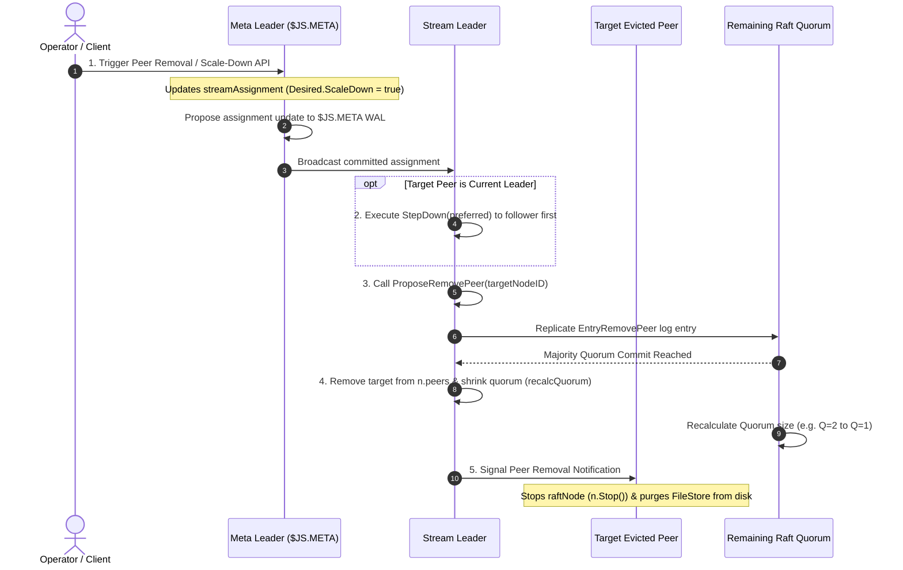

# Peer Removal & Stream Replica Scale-Down

Removing a node or scaling down stream replicas in NATS JetStream shrinks fault tolerance ($R > 1 \rightarrow R=1$) or evicts failed/degraded peers from stream Raft groups. This document details the trigger pathways, high-level conceptual flow, Go runtime mechanics, and operational performance impact during node removal.

---

## 1. Triggers & Operator Actions

Stream replica scale-down or peer removal can be initiated through three distinct pathways:

### 1.1 Trigger Comparison & Required Operator Actions

| Trigger Pathway | Initiator | Required Operator Action | Operational Outcome |
| :--- | :--- | :--- | :--- |
| **Manual Scale-Down** | Client / Operator | Run `nats stream update <stream> --replicas=N` or issue API update | Reduces stream replication factor and evicts excess peers from stream cluster |
| **Manual Peer Eviction** | Operator | Run `nats stream cluster peer remove <stream> <node_id>` | Directs stream cluster to evict a specific node from peer group |
| **Auto Self-Healing** | Meta Leader (`$JS.META`) | **Zero operator action required** | Meta Leader automatically detects node death, allocates replacement peer (if $R > 1$), and evicts dead node |

---

## 2. Layer 1: High-Level Conceptual Flow & Working Principles

### 2.1 Working Principles

- **Graceful Leader Eviction**: If the active Stream Leader is targeted for removal, it executes `StepDown(preferred)` to transfer leadership to a non-evicted follower *before* removing itself, eliminating publish errors or dropped messages.
- **Single Membership Change Guard (`n.membChange`)**: Raft strictly enforces that only one membership change (add or remove) can be processed at a time. This prevents concurrent membership modifications that could cause Raft split-brain conditions.
- **Immediate Quorum Shrinking**: Upon quorum commit of `EntryRemovePeer`, all surviving nodes update their `n.peers` map and immediately invoke `n.recalcQuorum()`, reducing the required consensus quorum size ($Q = \lfloor R/2 \rfloor + 1$) without waiting for target cleanup.
- **Storage Resource Reclaim**: The evicted node unsubscribes from internal system subjects, terminates its Raft timers, and purges all stream block files (`1.blk`) and directory structures from disk.

---

## 3. Layer 2: Go Runtime Implementation Mechanics

### 3.1 Step 1: Ingress & Meta Update

- **Primary Source File**: `server/jetstream_cluster.go`
- **Function**: `s.jsClusteredStreamUpdateRequestLocked()`
- **Goroutine Context**: API Handler Goroutine

1. Detects scale-down condition (`newCfg.Replicas < currentReplicas`).
2. Sets `rg.Desired.ScaleDown = true`.
3. Encodes updated `streamAssignment` and calls `meta.Propose(encodeUpdateStreamAssignment(sa))` to commit the assignment into the `$JS.META` Raft log.

### 3.2 Step 2: Stream Leader Handover Check (`removeEvictedPeers`)

- **Primary Source File**: `server/jetstream_cluster.go`
- **Function**: `removeEvictedPeers()`
- **Goroutine Context**: Stream Leader Worker / Migration Goroutine

1. Stream Leader evaluates candidate peers for removal.
2. **Leader Eviction Guard**: If `remove == ourPeerID` (the leader itself is being removed), it calls `n.StepDown(preferred)` to hand over leadership to a non-evicted follower **first**.
3. Once a stable non-evicted leader is active, it calls `n.ProposeRemovePeer(remove)`.

### 3.3 Step 3: Raft Log Membership Proposal (`ProposeRemovePeer`)

- **Primary Source File**: `server/raft.go`
- **Function**: `n.ProposeRemovePeer(peer)`
- **Goroutine Context**: Stream Leader Raft Loop

1. Verifies `n.membChange == nil` (prevents overlapping membership operations).
2. Pushes `newEntry(EntryRemovePeer, []byte(peer))` to `n.prop` queue.
3. Appends entry to Leader WAL (`n.wal`) and replicates over `$SYS.RAFT.<group_id>.A`.

### 3.4 Step 4: Quorum Shrinking (`recalcQuorum`)

- **Primary Source File**: `server/raft.go`
- **Function**: `n.applyRemovePeer()` -> `n.recalcQuorum()`
- **Goroutine Context**: Quorum Nodes Raft Apply Loop

1. Upon quorum commit of `EntryRemovePeer`, remaining nodes delete `peer` from their `n.peers` map.
2. Leader calls `n.recalcQuorum()`, shrinking quorum size $Q = \lfloor R/2 \rfloor + 1$ (e.g., $Q = 2 \rightarrow 1$ when scaling $R=3 \rightarrow R=1$).

### 3.5 Step 5: Target Node Destruction & Storage Cleanup

- **Primary Source Files**: `server/jetstream_cluster.go` & `server/stream.go`
- **Function**: `mset.stop()` -> `mset.delete()`
- **Goroutine Context**: Target Node Stream Controller Goroutine

1. Target node receives the removal update from `$JS.META` or Raft apply loop.
2. Invokes `n.Stop()` to terminate Raft timers and unsubscribe from `$SYS.RAFT` subjects.
3. Calls `mset.store.Delete()` to delete block files (`1.blk`) and clean up the storage directory from disk.

---

## 4. Operational & Performance Impact During Operation

| Operational Dimension | Impact Level | Detailed Behavioral Characteristics |
| :--- | :--- | :--- |
| **Client Publish Latency** | Zero Impact | Client writes continue normally on remaining quorum nodes without interruption |
| **Leadership Transition** | Graceful StepDown | If active leader is removed, it executes `StepDown(preferred)` before self-eviction, preventing publisher errors |
| **Quorum Availability** | Instant Shrink | Quorum size ($Q$) shrinks immediately upon `EntryRemovePeer` commit (e.g., $Q=2 \rightarrow 1$), preserving write availability |
| **Network & CPU Load** | Immediate Reduction | Eliminates background heartbeat and replication traffic to the evicted node |
| **Disk Storage** | Reclaimed Space | Evicted node purges block files (`1.blk`) and removes local storage directory from disk |
| **Membership Safety** | Single Guard | `n.membChange` guard enforces single membership change at a time to prevent Raft split-brain |