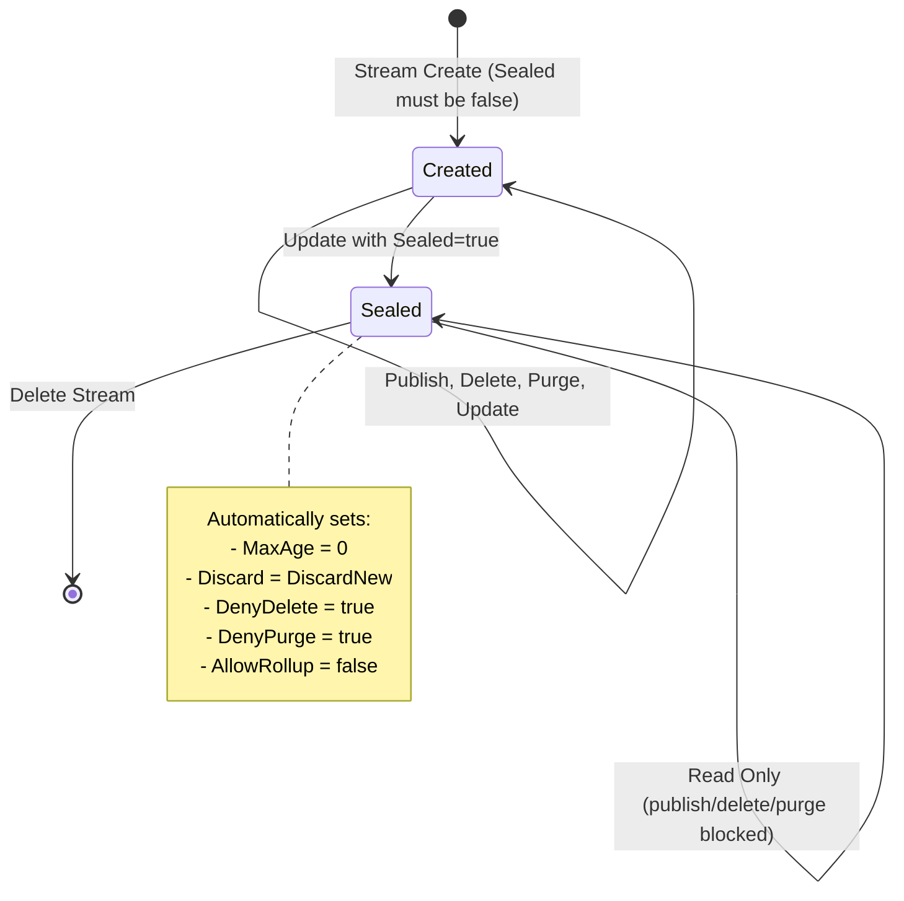

# Stream Update

Existing stream configurations can be modified dynamically using the Stream Update API without re-creating the stream or losing stored message history. The update is published to `$JS.API.STREAM.UPDATE.<stream_name>` with a full `StreamConfig` JSON payload reflecting the desired final state.

---

## Update Flow

### 1. Request Validation

The server validates the update request before applying changes.

| Check | Detail |
| ----- | ------ |
| Stream existence | Target stream must exist |
| Immutable field protection | Fields like `Name`, `Storage`, `Retention`, `MaxConsumers`, `DenyDelete`, `DenyPurge` cannot be changed after creation |
| Config normalization | General config normalization runs (defaults for `Duplicates` window, `Storage`, `Replicas`, `MaxMsgs`, etc.) |
| Sealed stream guard | A sealed stream cannot be unsealed; attempting `Sealed: false` on a sealed stream returns an error |

### 2. Seal Handling

If the update sets `Sealed: true`, the server automatically forces additional config changes after normalization (see Seal section below).

### 3. Config Application

The server applies the validated configuration, updates subjects, sources, mirrors, duplicates timers, and other dynamic properties. In clustered deployments, the update is proposed through the Meta Raft log and applied on all assigned replica nodes after commit.

---

## Seal

### What Is Seal

`Sealed` is a boolean field on `StreamConfig` that makes a stream permanently read-only. Once sealed, the stream becomes an immutable archive -- its data is frozen in place.

```go
// Sealed will seal a stream so no messages can get out or in.
Sealed bool `json:"sealed"`
```

Sealing is a one-way, irreversible operation. You cannot unseal a sealed stream.

### What Seal Does

When a stream is sealed, the server automatically forces these configuration changes to ensure the stream is fully locked down:

| Field | Changed To | Purpose |
| ----- | ---------- | ------- |
| `MaxAge` | `0` | Messages never expire by age |
| `Discard` | `DiscardNew` | Reject any new messages |
| `DenyDelete` | `true` | Prevent individual message deletion via API |
| `DenyPurge` | `true` | Prevent stream purge via API |
| `AllowRollup` | `false` | Disable rollup headers |

After sealing, the following operations are blocked:

| Operation | Result |
| --------- | ------ |
| Publish new messages | Blocked -- `JSStreamSealedErr` (error code 10109, HTTP 400) |
| Publish via internal/R1 path | Blocked -- `JSStreamSealedErr` |
| Publish via cluster Raft proposals | Blocked -- `JSStreamSealedErr` |
| Delete individual messages | Blocked -- `JSStreamSealedErr` |
| Purge stream | Blocked -- `JSStreamSealedErr` |
| Unseal (set `Sealed: false`) | Blocked -- invalid config error |
| Read / Subscribe to existing messages | Allowed -- consumers can still read |
| Delete the stream itself | Allowed |

Sealing blocks all write and mutation operations. Existing consumers can still read messages. The entire stream can still be deleted if no longer needed.

### When to Use Seal

| Use Case | Scenario |
| -------- | -------- |
| Audit logs | Seal a stream after an audit period to guarantee immutability of the records |
| Data archival | Freeze a stream as a point-in-time snapshot that can never be tampered with |
| Compliance | Regulatory scenarios (e.g., financial records) where data must be provably unmodified after a cutoff |
| Mirror sources | Seal the original stream after replication is complete, ensuring the canonical copy is immutable |

### Seal Internals

#### Cannot Create Already Sealed

You cannot create a stream with `Sealed: true` from the start. The API rejects it at both the standalone and cluster layers:

```go
// Can't create a stream with a sealed state.
if cfg.Sealed {
    resp.Error = NewJSStreamInvalidConfigError(
        fmt.Errorf("stream configuration for create can not be sealed"))
    ...
}
```

A stream must first be created normally, then sealed via the update API.

#### Seal via Stream Update

The only way to seal a stream is to update an existing stream, setting `Sealed: true` in the `StreamConfig` payload sent to `$JS.API.STREAM.UPDATE.<stream_name>`.

When the server processes the update, the seal block runs after general config normalization (`checkStreamCfgLocked`). The normalization step handles defaults (`Duplicates` window, `Storage`, `Replicas`, etc.) that apply to every create and update regardless of `Sealed` state. The seal-specific config changes (table above) are applied exclusively by the seal block.

```go
if cfg.Sealed {
    cfg.MaxAge = 0
    cfg.Discard = DiscardNew
    cfg.DenyDelete = true
    cfg.DenyPurge = true
    cfg.AllowRollup = false
}
```

One subtle interaction: `checkStreamCfgLocked` would normally reject `DenyPurge && AllowRollup` as invalid, but this cannot conflict with seal because the seal block runs after that check and explicitly sets `AllowRollup = false`.

#### Irreversible -- Cannot Unseal

Attempting to set `Sealed: false` on an already-sealed stream returns an error:

```go
if !cfg.Sealed && old.Sealed {
    return nil, NewJSStreamInvalidConfigError(
        fmt.Errorf("stream configuration update can not unseal a sealed stream"))
}
```

#### Enforcement Architecture

Seal is enforced at every layer of the NATS server to prevent bypass:

- **API layer** (`jetstream_api.go`) -- Publish, delete, and purge requests are rejected with `JSStreamSealedErr` before reaching the stream
- **Stream layer** (`stream.go`) -- `processStreamMsg` and `processJetStreamMsg` check the sealed flag and reject messages
- **Cluster layer** (`jetstream_cluster.go`) -- Raft proposals for sealed streams are rejected
- **Config update validation** (`stream.go`) -- Unseal attempts are rejected during config update validation

The error returned for all sealed stream violations is `JSStreamSealedErr` (error code 10109, HTTP 400):
```
"invalid operation on sealed stream"
```

#### Update Call Chain

When sealing a stream, the server call chain is:

1. `updateWithAdvisory()` calls
2. `configUpdateCheck()` -> `configUpdateCheckLocked()` which:
   - First calls `checkStreamCfgLocked()` (general config normalization)
   - Then runs the seal block that forces the five config changes
3. The rest of `updateWithAdvisory()` handles subjects, sources, mirrors, and duplicates timers, none of which are conditional on the sealed flag

#### Lifecycle



---

## Key Behaviors

| Aspect | Detail |
| ------ | ------ |
| API subject | `$JS.API.STREAM.UPDATE.<stream_name>` |
| Payload | Full `StreamConfig` JSON with desired final state |
| Immutable fields | `Name`, `Storage`, `Retention`, `MaxConsumers`, `DenyDelete`, `DenyPurge` cannot be changed |
| Seal | One-way operation; automatically forces `MaxAge=0`, `DiscardNew`, `DenyDelete`, `DenyPurge`, `AllowRollup=false` |
| Unseal | Not possible; returns invalid config error |
| Sealed error | `JSStreamSealedErr` (error code 10109, HTTP 400) for all write operations on sealed streams |
| Clustered path | Update proposed through Meta Raft log and applied on all replica nodes after commit |